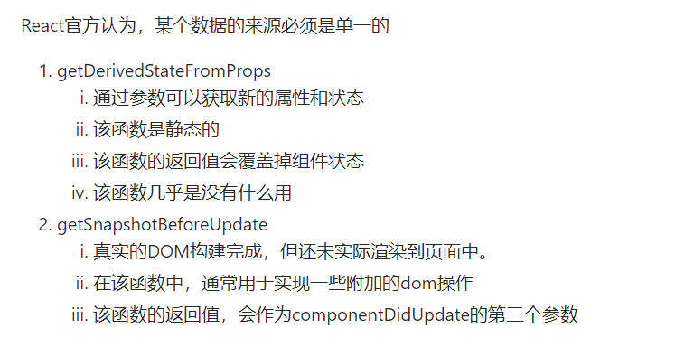
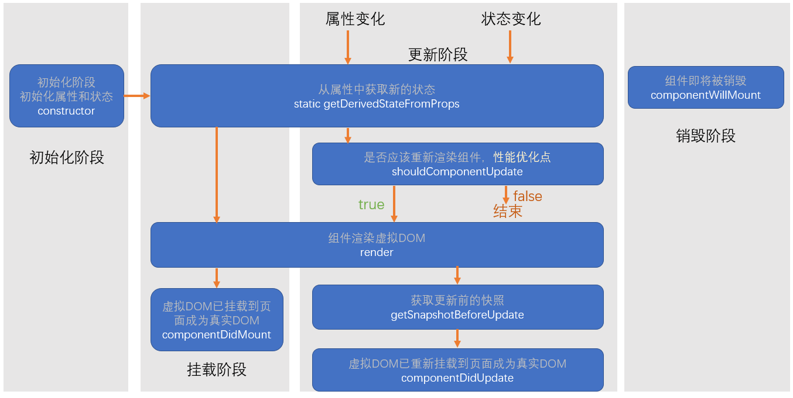

# 生命周期
>组件从诞生到销毁会经历一系列过程，这个过程就叫做生命周期

生命周期仅存在于类组件中，函数组件每次调用都是重新运行函数，旧的组件即刻被销毁

1. constructor
    - 组件初始化阶段，在里面初始化state,this.state={}这样的格式
    - 严禁在此阶段使用setSate

2. componentWillMount
   - 组件将会被挂载到页面之前
   - 和构造函数一样之后执行一次
   - 可以使用setState，但是为了避免bug最好不使用

3. render
   - 会返回一个虚拟dom，会被挂载到虚拟dom树，最终渲染页面的真实Dom
   - 每次重新渲染都会执行
   - 严禁使用setState,否则会无线渲染

4. componentDidMount
   - 页面被挂载时执行
   - 只执行一次
   - 可以使用setState
   - 一般在其中进行请求，开启计时器等操作
  
5. 组件进入活跃状态
   
6. componentWillReceiveProps
   - 即将接受新的属性值
   - 参数为新的属性对象
   - 该函数可能会导致一些bug
  
7. shouldComponnentUpdate
   - 决定是否重新渲染该组件，通过true和false决定
   - 默认情况下，会直接返回true

8. componentWillUpdate
   - 组件即将被重新渲染

9. componentDidUpdate
    - 组件重新渲染完成，往往在该函数中使用dom操作，改变元素

10. componentWillUnmount
    -组件即将被卸载，通常用于销毁一些组件依赖的资源

## 新版生命周期

关于getDerivedStateFromProps
因为在旧版的生命周期中，一些开发者会利用componentWillReceiveProps中来书写一些代码想让props和state同步，但却有可能会造成bug，react官方认为,某个数据的来源必须是单一的，要么来自于状态要么来自于属性，通过这样的代码props和state来同步被官方认为反模式，于是compoenntWillReceiviProps被废除，而使用getDeriviedStateFromProps来代替，告诉开发者不要使用这种反模式，数据要么来自props，要么来自状态，而这个生命周期函数本身没有多大用处