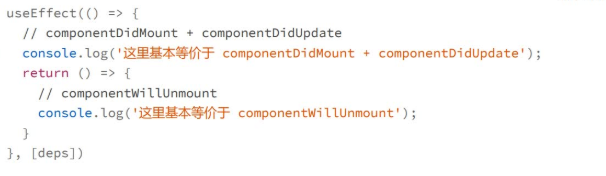
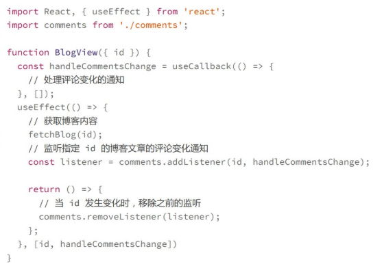

在类组件中componentDidMount,componentWillUnMount和componentDidUpdate这三个生命周期函数是日常开发中最常用的

**基本等价于**
没有完全等价于传统的生命周期函数的原因
1. useEffect(callback) 这个 Hook 接收的 callback只有在依赖项发生变化才会执行，而传统的componentDidUpate则一定会执行，这样来看，Hook的机制其实更具有语义化，因为过去在componentDidUpdate中，我们通常需要手动判断某个状态是否发生变化，然后再执行特定的逻辑
2. callback返回的函数(一个用于清理工作)在下一次依赖项发生变化以及组件销毁之前执行，而传统的componentWillUnMount只在组件销毁时才会执行

useEffect 接收的返回值是一个回调函数,这个回调函数不只是会在组件销毁时执行,而且是每次Effect重新执行之前都会执行，用于清理上一次的Effect