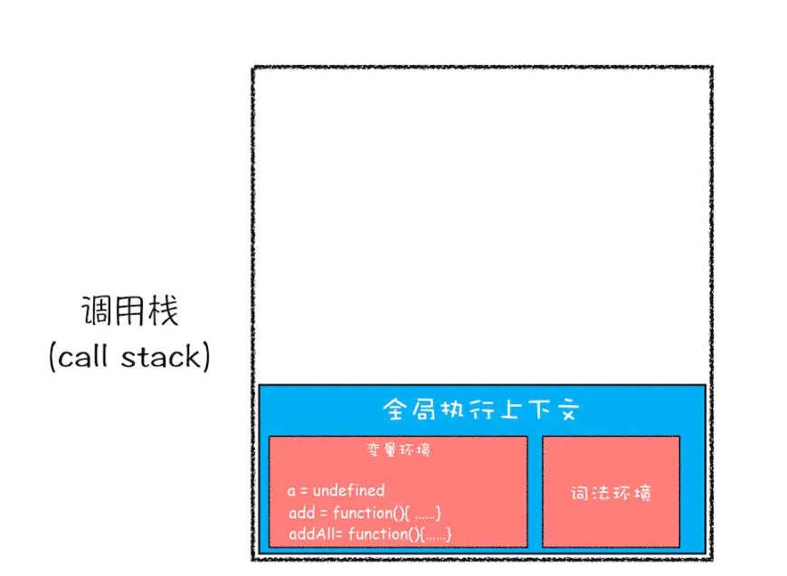
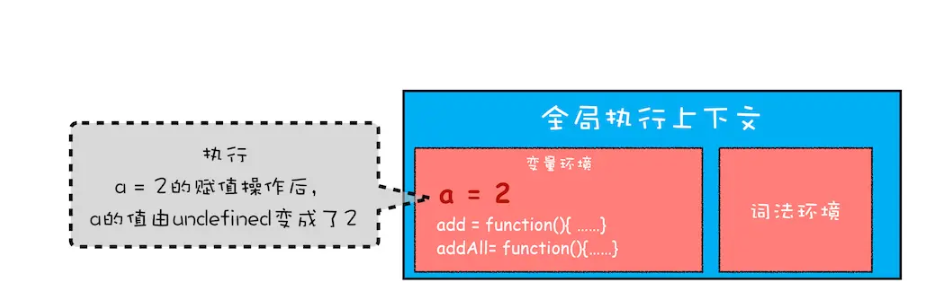
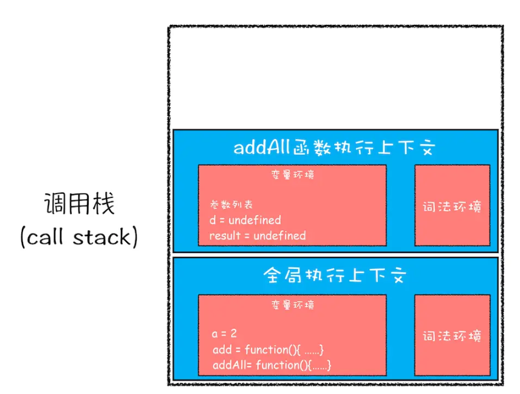
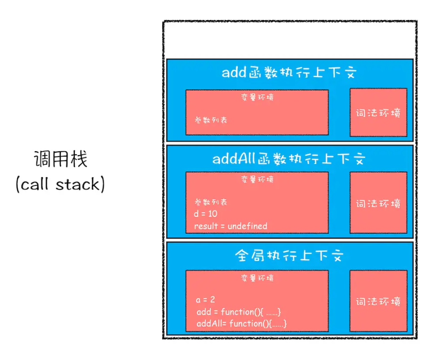
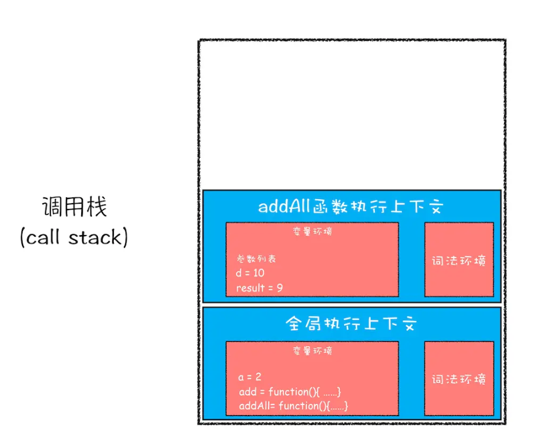
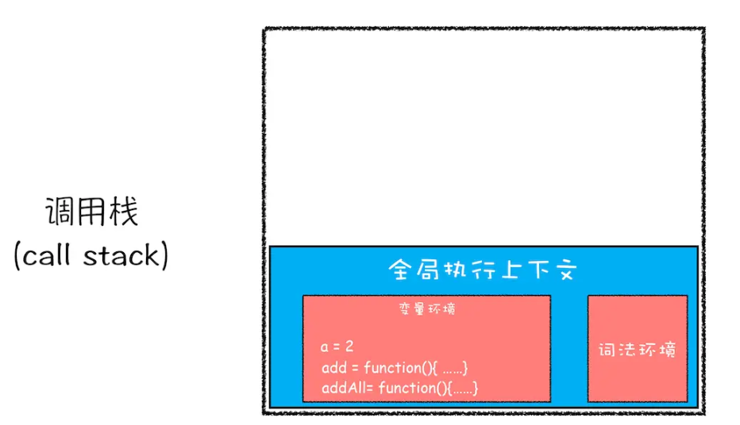
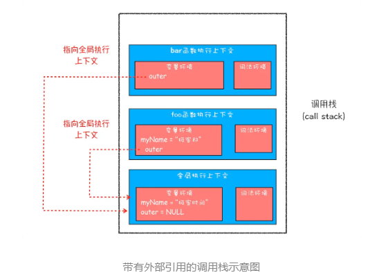
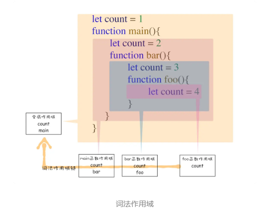
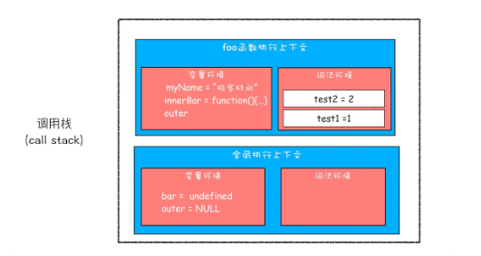

# 执行上下文

执行上下文:一个函数运行之前，创建的一块内存空间，空间中包含该函数执行所需要的数据，为该函数执行提供支持
执行上下文堆栈:所有执行上下文组成的内存空间

## 执行上下文中的内容
1. this指向
   this在全局环境中指向全局对象，在浏览器环境中是window对象
   - 直接调用函数，this指向全局对象
   - 在函数外，this指向全局对象
   - 通过对象调用或new一个函数，this指向这个对象
2. VO变量对象
   VO中记录了变量提升的内容

例子

```
var a = 2
function add(b,c){
  return b+c
}
function addAll(b,c){
var d = 10
result = add(b,c)
return  a+result+d
}
addAll(3,6)
```

**第一步，创建全局上下文，将其压入栈底部**

执行到a=2

**第二步，调用addAll**

**第三步，当执行到add函数**

**第四步，add函数返回时，该函数的执行上下文从栈顶弹出**

**第五步，弹出addAll的执行上下文**

**最后，调用栈中就只剩下全局上下文，至此，整个Javascript流程执行结束**

**调用栈就是Javascript引擎追踪函数执行的一个机制**

## 作用域
作用域就是指程序中定义变量的区域，该位置决定了变量的生命周期，通俗地理解，作用域就是变量与函数的可访问范围，即作用域控制着变量和函数的可见性和生命周期
- 全局作用域，全局作用域中的对象在代码中的任何地方都能访问，其生命周期伴随着页面的生命周期
- 函数作用域就是函数内部定义的变量和函数，并且定义的变量或者函数只能在函数内部被访问，函数执行结束之后，函数内部定义的变量就会被销毁

**ES6之前不支持块级作用域**
**变量提升带来的问题**
1. 变量容易在不被察觉的情况下被覆盖掉
2. 本该被销毁的变量没有被销毁


**ES6如何解决变量提升带来的缺陷**
引入了let和const关键字
**Javascript如何支持块级作用域的**
```

function foo(){
    var a = 1
    let b = 2
    {
      let b = 3
      var c = 4
      let d = 5
      console.log(a)
      console.log(b)
    }
    console.log(b) 
    console.log(c)
    console.log(d)
}   
foo()
```


第一步，编译并创建执行上下文
1. 函数内部通过var声明的变量在编译阶段全都被存放在变量环境里面了
2. 通过let声明的变量，在编译阶段会被存放到词法环境
3. 在函数的作用域块内部，通过let声明的变量并没有被存放到词法环境中

第二部继续执行代码，当进入函数的作用域块时，作用域块中通过let声明的变量会被存放在词法环境的一个单独的区域中，这个区域中的变量并不会影响作用域块外面的变量

在词法环境内部维护一个小型栈结构，栈底时函数最外层的变量，进入一个作用域块后，就会把该作用域块内部的变量压入到栈顶，当作用域执行完成之后，该作用域的信息就会从栈顶弹出

## 作用域链
```

function bar() {
    console.log(myName)
}
function foo() {
    var myName = "极客邦"
    bar()
}
var myName = "极客时间"
foo()
```
每个执行上下文的变量环境中，都包含一个外部引用，用来指向外部的执行上下文，我们把外部引用称为outer，由outer连接起来的链条就是作用域链
**词法作用域**
词法作用域就是指作用域是由代码中函数声明的位置来决定的，所以词法作用域是静态的作用域，通过它就能够预测代码在执行过程中如何查找标识符。
JavaScript 作用域链是由词法作用域决定的



**闭包**
```

function foo() {
    var myName = "极客时间"
    let test1 = 1
    const test2 = 2
    var innerBar = {
        getName:function(){
            console.log(test1)
            return myName
        },
        setName:function(newName){
            myName = newName
        }
    }
    return innerBar
}
var bar = foo()
bar.setName("极客邦")
bar.getName()
console.log(bar.getName())
```

根据词法作用域的规则，内部函数 getName 和 setName 总是可以访问它们的外部函数 foo 中的变量，
foo 函数执行完成之后，其执行上下文从栈顶弹出了，但是由于返回的 setName 和 getName 方法中使用了 foo 函数内部的变量 myName 和 test1，所以这两个变量依然保存在内存中

闭包的正式定义:在 JavaScript 中，根据词法作用域的规则，内部函数总是可以访问其外部函数中声明的变量，当通过调用一个外部函数返回一个内部函数后，即使该外部函数已经执行结束了，但是内部函数引用外部函数的变量依然保存在内存中，我们就把这些变量的集合称为闭包。比如外部函数是 foo，那么这些变量的集合就称为 foo 函数的闭包。