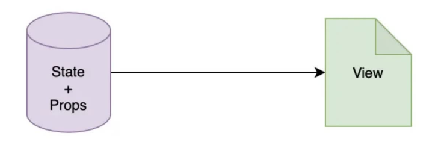

# react hooks和class对比
react组件的模型就是从model到view的映射，这里的model就是react中的state和props

当model中的状态改变，UI自动变化，就是所谓的数据绑定

**Class组件适合上面的模式吗?**
1. react组件之间不会相互继承，react没有利用到class的继承特性
2. 所有UI都是由状态驱动，很少会在外部去调用一个类实例，组件的所有方法都是再内部调用，或作为生命周期方法被自动调用
>class中的两个重要特性没有用到，通过函数去描述一个组件才是最为自然的方式

**比起Class组件，函数组件更适合去表达React组件的执行，因为它符合state=>view这样的逻辑关系，但是缺少状态，生命周期等机制，让他功能受限，有hooks，函数组件的力量终于能够发挥出来了**

#### 逻辑复用(最大好处)
Class在使用逻辑复用时使用了高阶组件，但是缺点明显
- 代码难理解，不直观
- 会增加很多额外的组件节点，每一个告诫组件都会多一层节点，这会给调试带来负担

hooks实现逻辑复用更加简洁直观，不会产生额外的组件节点

#### 关注分离
hooks能够让针对同一业务逻辑的代码尽可能聚合在一块儿，在class组件中，我们不得不把同一业务逻辑的代码分散在类组件的不同生命周期中

