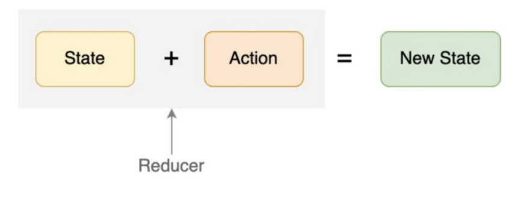
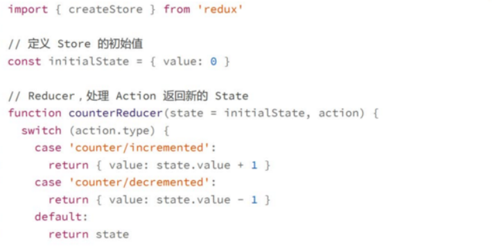
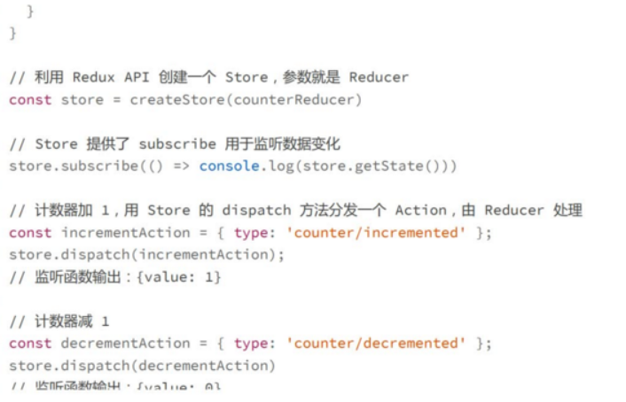
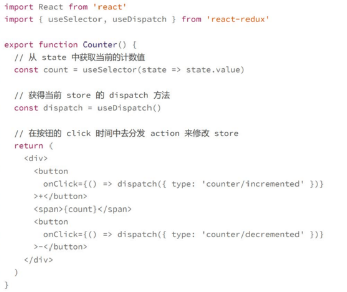
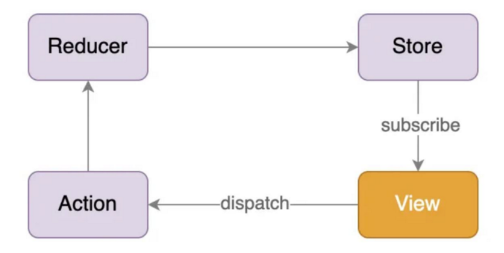
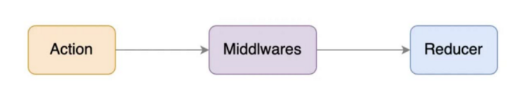
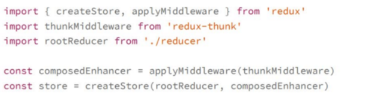
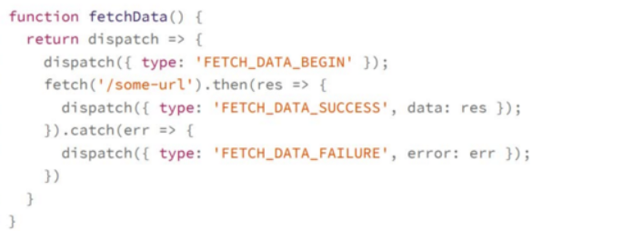

#redux 全局状态管理

## 出现背景
组件级别的state和从上而下传递的props这两个状态机制，不能够满足复杂功能的需要，例如跨层级之间的组件数据共享和传递
单个react组件它的状态可以用内部的state来维护，redux用全局唯一的store来维护了整个应用程序的状态，页面的多个组件，都是从这个store中获取状态来保证组件之间能够共享状态
redux store的两个特点
1. redux store是全局唯一的，整个应用程序一般只有一个store
2. redux store是树状结构，可以更天然地映射到组件树的结构

## redux的三个基本概念
- state，即是store，一般就是一个纯的Javascript Object
- Action,也是一个Object，用于描述发生的动作
- 而Reducer则是一个函数，接收action和state作为参数，通过计算得到新的store

在redux中所有Store的修改必须通过reducer去完成，而不是直接修改state，一方面可以保证数据的不可变性，同时也能够带来两个非常大的好处
- 可预测，给定一个初始状态和一系列的action一定能够得到一致的结果，同时让代码更容易测试
- 易于调试，可以跟踪store的数据变化，甚至是暂停和回放

**创建redux的完整逻辑**
1. 创建store,
2. 再利用Action和Reducer修改State
3. 最后利用subscribe监听Store的变化
**reducer每次返回新的对象，确保不可变数据的原则**
大部分场景下延展运算符等已经足够使用，对于复杂的数据结构，也有第三方库如immer,immutable等等

## 在react中使用redux
主要有两点
1. react组件能够在依赖的Store数据发生变化时，重新render
2. 在react组件中，能够在某些时机去dispatch一个action，从而触发Store的更新
利用react-redux这样一个工具库，建立一个桥梁让react和redux进行通信
利用Context机制去存放Store的信息，通常我们会将这个给context作为整个react应用程序的根节点
>**context具有数据绑定的能够，用context将react-redux保存在全局，只要组件对store中的数据有依赖，就会重新渲染**

这样在函数组件中使用redux就能够利用react-redux提供的useSelectore,useDispatch
>**useSelectore**:能够让一个组件在Store的某些数据变化时重新render

**数据流**
reducer必须是一个纯函数，便于测试和调试
创建action的函数也必须马上返回结果
action必须是一个平面对象，dispatch源码中，传递过来的action如果不是平面对象会抛出错误

## 使用redux处理异步逻辑
在redux中，处理异步逻辑常常被称为异步action

一个异步请求的过程，这段代码使用了三个同步action完成了这个异步请求，这里将store完全作为一个存放数据的地方，至于数据哪里来，redux并不关心
但是这样发送请求获取数据并进行错误处理了**这个逻辑是不可重用的**(原因在上面数据流那儿)，如果我们希望发送同样的请求就不得不将这段代码重新实现一遍，因此redux中提供了middleware这样一个机制来实现action

>middleware就是可以让你提供一个拦截器在reducer处理action之前调用，这个拦截器中你可以自由处理获得的action，

redux中的action不仅仅可以是一个Object，它可以是任意东西，也可以是一个函数，redux提供了redux-thunl这样一个中间件，如果发现接受的action是一个函数，它不会传递给reducer,而是执行这个函数，并把dispatch作为参数传递给这个函数，从而在这个函数中自由决定何时，如何发送Action
1. 创建时指定thunk中间件

2. 在dispatch action时可以dispatch一个函数来发送请求
