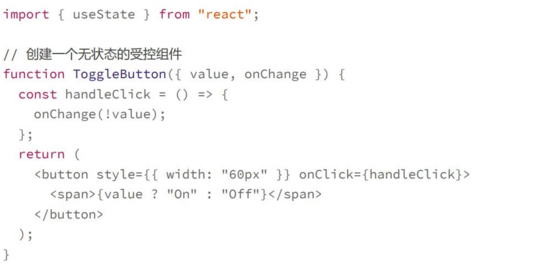
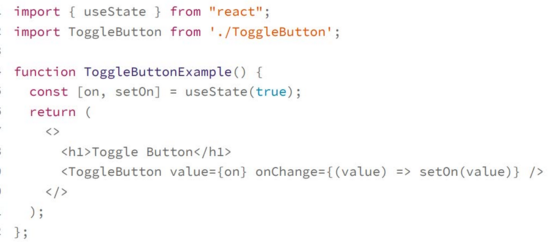

# 事件处理:如何创建自定义事件
## 在react中使用原生事件
对于原生DOM的事件，标准的写法可能都是小写，比如onclick,但react中，都是约定使用小驼峰，只要原生DOM有的事件，在react中基本都可以使用
**如果你使用的是自定义组件或者一些UI框架的组件，那么回调函数还都应该用useCallback封装**
## react原生事件的原理
由于虚拟dom的存在，在react中即使绑定一个事件到原生的dom节点，事件也步兵不会绑定在对应的节点上，而是**所有的事件都绑定在整个App的根节点上**，然后由react统一监听和管理，**获取事件后再分发到具体虚拟dom的节点上**
原因由两个
1. 虚拟dom render的时候，Dom很可能还没有真实地render到页面上，所以无法绑定事件
2. react可以屏蔽底层事件的细节，避免浏览器的兼容性问题

为什么事件绑定在某个根节点上，也能够触发实际DOM节点的事件?
>在浏览器的原生机制中，事件会从被触发的节点往父节点冒泡，然后沿着整个路径一直到根节点，所以根节点其实可以收到所有的事件，这就是**浏览器事件的冒泡模型**
因此无论事件在哪个节点被触发，react都可以通过事件的srcElement这个属性知道它是从哪个节点开始发出的，这样react就可以手机管理所有的事件，然后再以一直API暴露出来

对于原生事件的处理，可以说是React的一个创新，不仅能够让你像以前在原生节点上定义事件的方式一样，而且还提供了一直的API，让我们不用再担心浏览器的兼容问题，使用起来更简单
## 创建自定义事件
虽然自定义事件和原生事件看上去类似，但是两者的机制完全不一样
1. 原生事件是浏览器的机制
2. 而自定义事件则是纯粹的组件的自己行为，本质是一种回调函数机制

自定义事件实现on/off按钮切换
定义

使用
