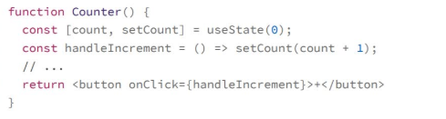
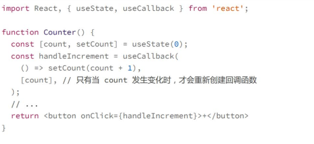
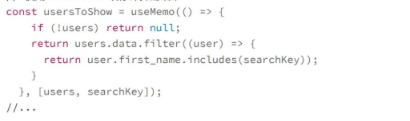
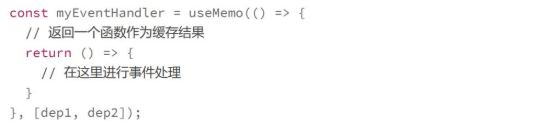
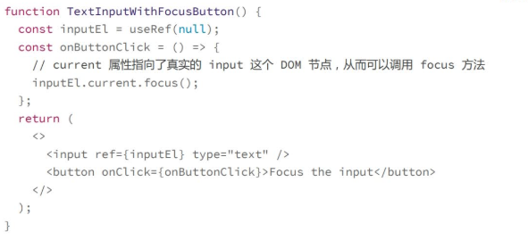
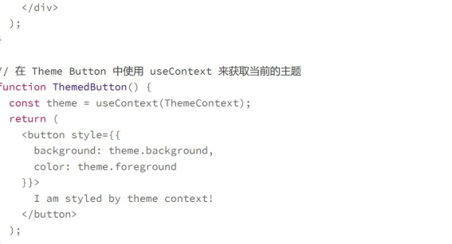

## useCallback：缓存回调函数
在react中每一次ui渲染都会重新执行整个函数来完成，而不是向class组件一个通过实例来位置状态，函数组件并没有一个直接的方式在多次渲染之间维持一个状态

每一个组件状态变化时，组件都会执行一遍，每次执行时都会重新创建一个handleIncreament函数，这样会**增加系统额外的开销**，更重要的是**每次创建新函数的方式会让接收事件处理的组件，需要重新渲染**
比如这个例子中的 button 组件，接收了handleIncrement，并作为一个属性。如果每次都是一个新的，那么这个 React 就会认为这个组件的 props 发生了变化，从而必须重新渲染。
我们需要做的时每次count变化时才需要重新定义个回调函数

## useMemo:缓存计算的结果
如果某个数据是通过其它数据计算得到的，那么只有当用到的数据，也就是依赖的数据发生变化的时候，才应该需要重新计算。

类似于计算属性，使用useMemo这个hooks一大好处时**避免重复计算**，还有一个更重要的好处是**避免子组件的重复渲染**
>**useCallback 的功能其实是可以用 useMemo 来实现的。**

**useCalLback和useMemo他们只是做了一件事情，建立了一个绑定某个结果到依赖数据的关系，只有当依赖变了，这个结果才需要被重新得到渲染**

## useRef:在多次渲染之间共享数据
const myRefContainer=useRef(initialValue);
我们可以把 useRef 看作是在函数组件之外创建的一个容器空间。在这个容器上，我们可以通过唯一的current属性设置一个值，从而在函数组件的多次渲染之间共享这个值。
useRef可以**存储跨渲染的数据**，useRef保存的数据一般是和UI的渲染无关的，因此**在ref的值发生变化时，是不会触发组件的重新渲染的**，这就是useRef和useState的区别，此外useRef还有一个重要的功能，就是保存某个DOM节点的引用，结合ref属性和useRef可以获取到真实dom

## useContext :定义全局状态
react提供了context这种机制，能够让所有在某个组件开始的组件树上创建的一个context,这样这个组件树上的所有组件都能够访问和修改这个context.
>cons value = useContext(MyContext);

一个Context是在某个组件为跟组件的组件书上可用，所以我们需要有API能够创建一个Context,这就是React.createContextAPI
>const MyContext = React.createContext(initialValue);

**Context看上去就是一个全局数据，为什么要设计这样的机制，而不是直接用一个全局的变量去保存数据呢**
>为了能够数据绑定，当这个context的数据发生变化时，使用这个数据的组件就能够自动刷新

**缺点**
1. 调试困难
2. 组件复用困难
