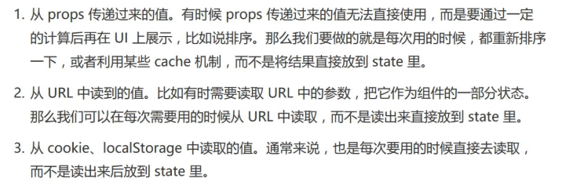
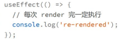
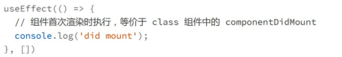
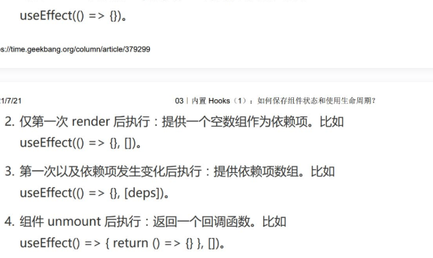
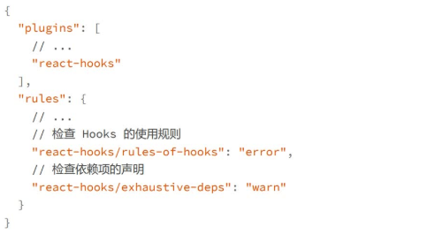

# 保存组件状态 & 使用生命周期

## useState
>让函数组件具有维持状态的能力，一个函数组件的多次渲染之间，这个state是共享的

用法
1. useState(initialState) 的参数 initialState 是创建 state 的初始值，它可以是任意类型，比如数字、对象、数组等等。
2. useState() 的返回值是一个有着两个元素的数组。第一个数组元素用来读取 state 的值，第二个则是用来设置这个 state 的值。在这里要注意的是，state 的变量（例子中的count）是只读的，所以我们必须通过第二个数组元素 setCount 来设置它的值。
3. 如果要创建多个 state，那么我们就需要多次调用 useState。
比如要创建多个 state，使用的代码如下：

**类组件中的 state** 只能有一个。所以我们一般都是把一个对象作为 一个 state，然后再通过不同的属性来表示不同的状态。而函数组件中用 useState 则可以很容易地创建多个 state，所以它**更加语义化**。
**state中永远不要保存可以通过计算得到的值。**

state 虽然便于维护状态，但也有自己的弊端。一旦组件有自己状态，意味着组件如果重新创建，就需要有恢复状态的过程，这通常会让组件变得更复杂。
无状态组件可以成为更纯粹的表现层，没有太多的业务逻辑，从而更易于使用、测试和维护。
## useEffect:用于执行一段副作用
>副作用:一段和当前执行结果无关的代码

用法:useEffect(callback,dependencies)
callback:要执行的函数
dependencies:可选，如果不指定，callback就会在每次函数组件执行完成后都执行，如果指定，只有依赖项中的值发生变化的时候才会执行
**useEffect 是每次组件 render 完后判断依赖并执行**
1. 没有依赖项(denpendencies)
    >每次render后就会重新执行
    

2. 空数组为依赖项，则在首次执行时触发，对应到Class组件就是componentDidMount
   
useEffect还允许返回一个函数用于在组件销毁时做一些清理的操作，蕾仕于componentWillUnmount
**总结**

## hooks的依赖
在定义依赖项时，需要注意以下三点
1. 依赖项中定义的变量一定时会在回调函数中用到的，斗则声明依赖项没有任何意义
2. 依赖项一般是一个常量数组，而不是一个变量，一般在创建callback时，你就要清除要用到哪些依赖项
3. react对比依赖项是否发生变化是进行的浅比较
   
## hooks的使用规则
hooks的使用规则包括两个
1. 只能在函数组件的顶级作用域使用
2. 只能在函数组件或则其他hooks中使用

**只能在函数组件的顶级作用域使用**
>顶级作用域:就是hooks不能在循环，条件判断或者嵌套函数内执行，而必须实在顶层，同时hooks在组件的多次渲染之间，必须按照顺序被执行，因为react组件内部其实是维护了一个对应组件的固定的hooks执行列表的，以便在多次渲染之间保持hooks的状态
**- 所有hooks必须被执行到，所以不能将hooks放在可能的return之后**
**- 必须按照顺序执行**

**只能在函数组件或则其他hooks中使用**
hooks的使用情况只有两种
- 在函数组件内
- 在自定义hooks内

**使用ESLint插件帮助检查hooks的使用**
使用hooks的一些特性和要遵循的规则，就要时刻注意不能写错，包括下面三点
1. 在useEffect的回调函数中使用的变量都必须在依赖项中声明
2. Hooks不能出现在条件语句和循环中，也不能出现在return中
3. hooks只能在函数组件和自定义组件中使用

React 官方为我们提供了一个 ESLint 的插件，专门用来检查 Hooks 是否正确被使用，它就是eslint-plugin-react-hooks。

这个插件几乎是 React 函数组件开发必备的工具，能够避免很多可能看上去很奇怪的错误。所以作为开始开发的第一步，一定要安装并配置好这个插件。