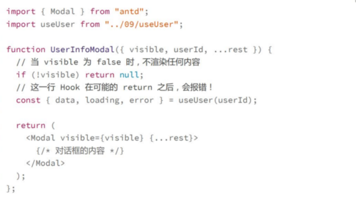
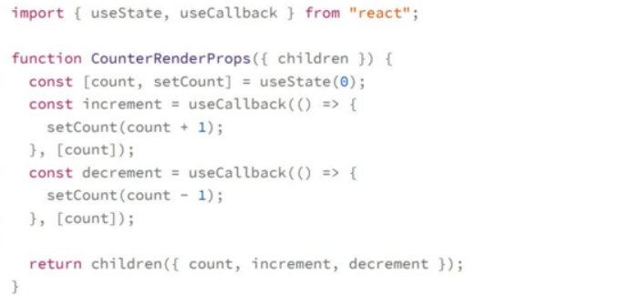
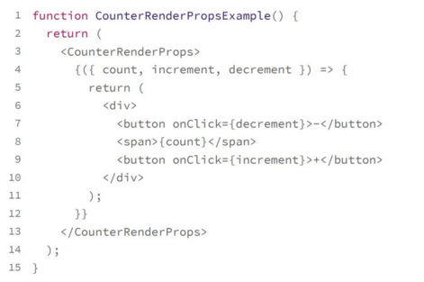
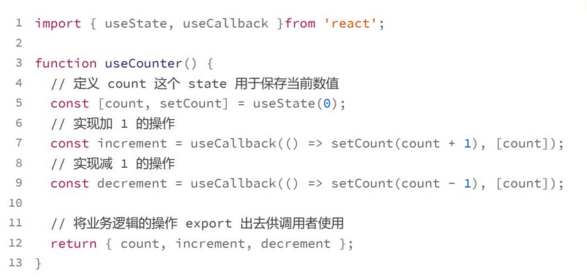

# 函数组件设计模式:如何应对复杂条件渲染场景
1. 一个和hooks相关用于解决hooks无法在条件语句中执行带来的一些难题
2. 另一个则是经典的render props模式，用于实现UI逻辑的重新

## 容器模式:实现按条件执行hooks

因为Hooks必须在顶层作用域中调用，这样得写法会报错
要完成实现这样的逻辑需要容器模式
具体做法就是把条件判断的结果放在两个组件之中，确保真正render Ui组件收到的所有属性都是优质的

## 使用render props模式来重用UI逻辑
render props解决了UI逻辑的重用问题，不仅适用于Class组件，在函数组件的场景下也不可或缺
>render props:把一个render函数作为属性值传递给某个组件，由这个组件去执行这个函数从而render实际的内容

**Hooks是逻辑重用的第一选择** ，不过hooks有一个局限就是只能用作数据逻辑的重用，而不涉及ui表现逻辑的重用，而这是render props擅长的地方
下面一个计数器的例子来介绍render props的用法

我们把计数器逻辑封装到一个完全不render任何ui的组件中，那么使用

我们可以使用其他的属性名字，而不是children,只需要把这个render函数作为属性传递给组件就可以了
这个例子是纯数据逻辑，，使用hooks更加方便
