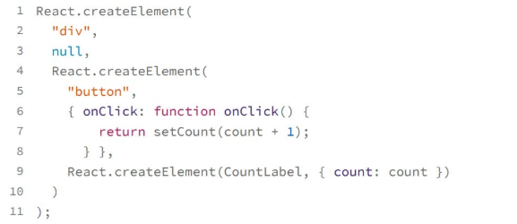

# 理解react的基本概念
- 组件
- 状态
- JSX

**1. 使用组件的方式描述UI**
   >react中所有的元素都是组件，分为内置组件(映射HTML中的div,span等，约定都是小写)，自定义组件，组件的组织和dom结构类似，是以数状结构组织到一起的

**2. 使用state和props管理状态**
  > react是通过数据的改变来自动重新渲染ui，所以需要state来保存状态，props用于父子组件传递状态

**3. JSX语法的本质**
   >react中的"模板语言"，本质上，JSX不是模板语言，而是**语法糖**

   
   - JSX 的表达能力等价于 JavaScript 的表达能力，那么所有我们可能需要的机制，比如循环、条件语句等等，JSX 其实都能灵活表达。
   - JSX 几乎不需要学习，只要你会用 JavaScript，就也会用 JSX。

**脚手架搭建项目**
工具
1. 一个是 codesandbox.io主要用于学习 React，能够快速试验一些 React 的特性。
2. 一个则是 Facebook 官方提供的 create-react-app 命令行具，用来创建一个基础的 React 项目。