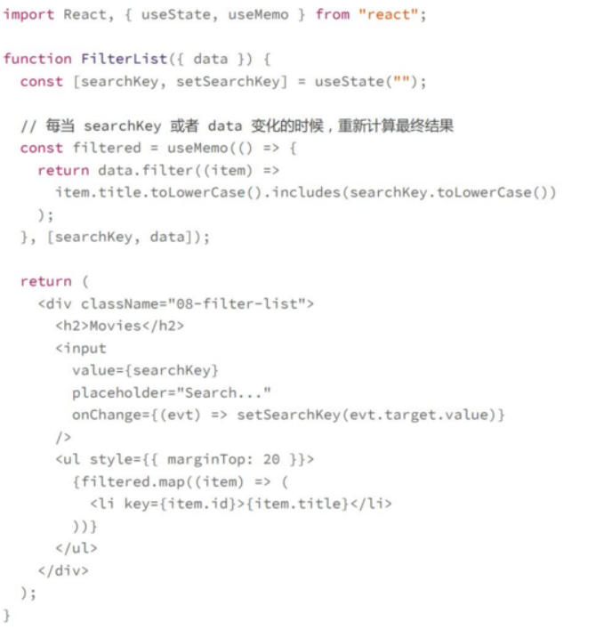
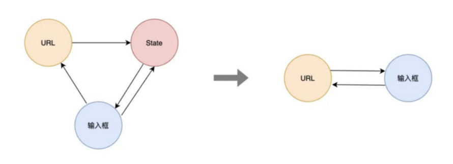
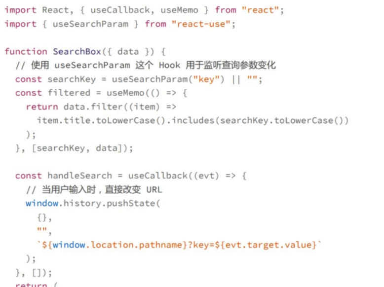
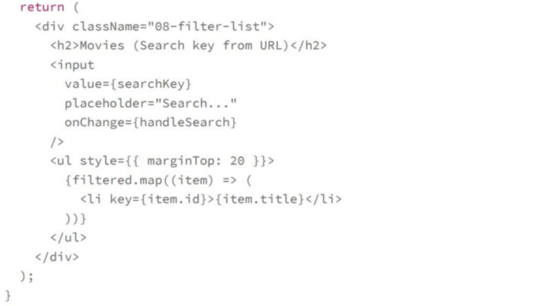

# 复杂状态处理：状态一致性
**改怎么去最优，最合理的方式管理你的应用程序的状态**

## 原则一
>在保证数据完整性的同时也要保证它的最小化

比如如果我们某些数据能够从已有的数据中计算得到，那么我们就应该始终在用的时候计算，而不要把计算的结果保存在某个state中，
对于那些只需要从原始数据计算得到的数据不保存在state中，为了不每次计算，影响性能，使用useMemo来解决这个给问题

## 原则二
>避免中间状态，确保唯一数据源

比如直接将url作为唯一的数据源，那么状态的读取和修改都是对url直接操作，而不是通过一个中间状态，这样简化了状态的管理，保证了状态的一致性




## 受控组件和非受控组件
**受控组件:** 组件的展示完全由传入的属性决定，比如说如果一个输入框中的值完全由传入的value属性决定，而不是由用户输入决定，那么就是受控组件，写法是
```
<input value={value} onChange={handleChange}><input/>
```
这也是为什么只给input传入value不传入onchange事件，键盘怎么输入都没有反应
**非受控组件:** 表单组件可以由自己的内部状态，而且他的展示值是不受控的，比如在input非受控状态下的写法是
```
<input onChange={handleChange}></input>,也就是父组件不会把value直接传递给input组件
```
**在日常开发中，大部分的表单元素其实都是受控组件**
