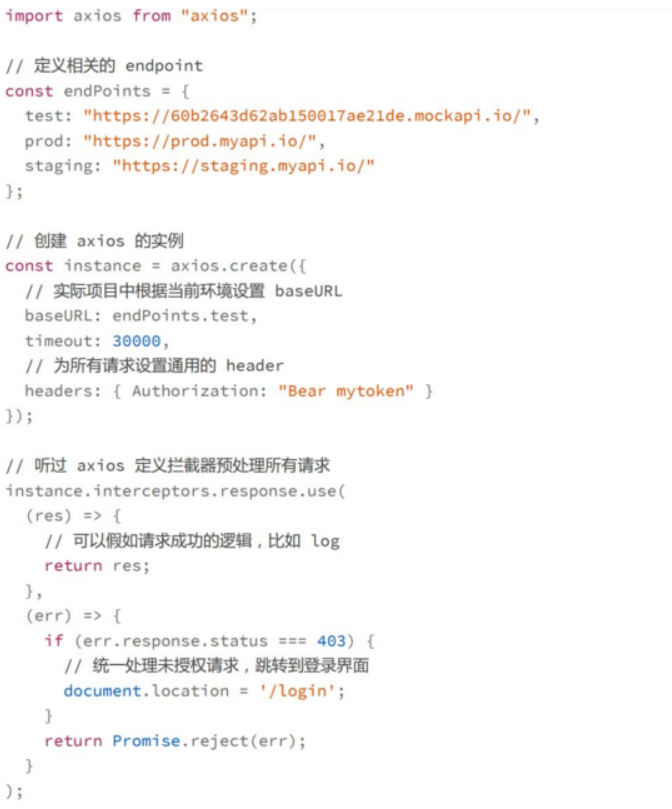
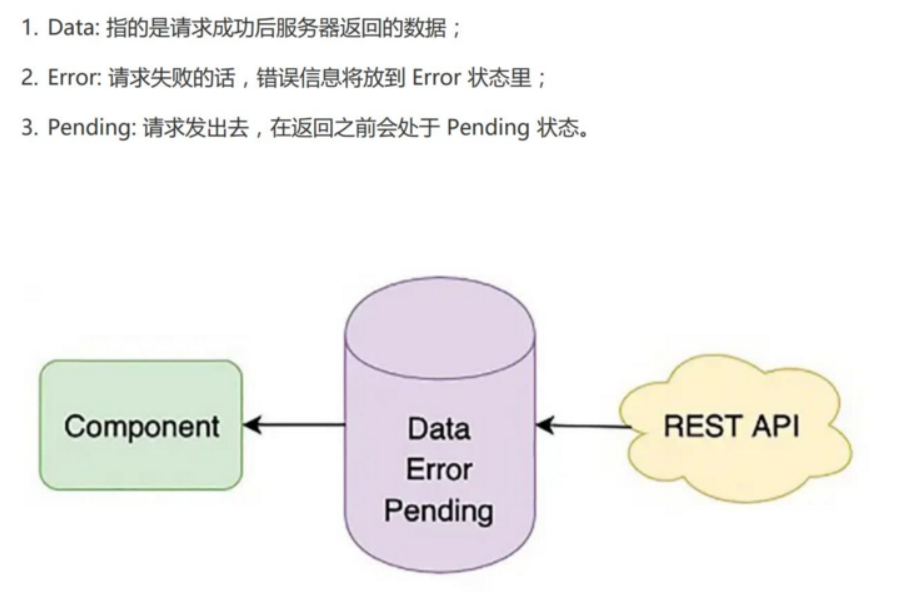
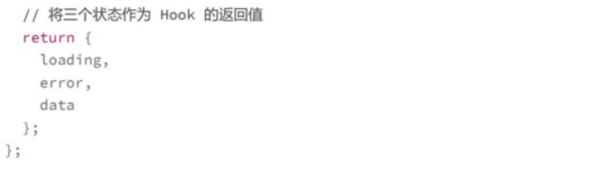
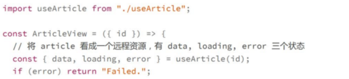
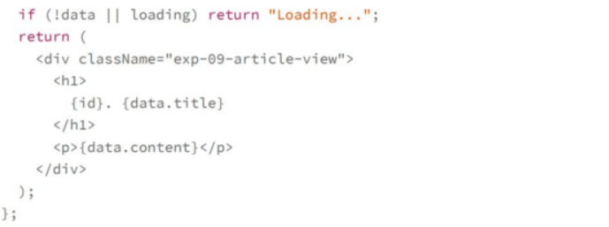
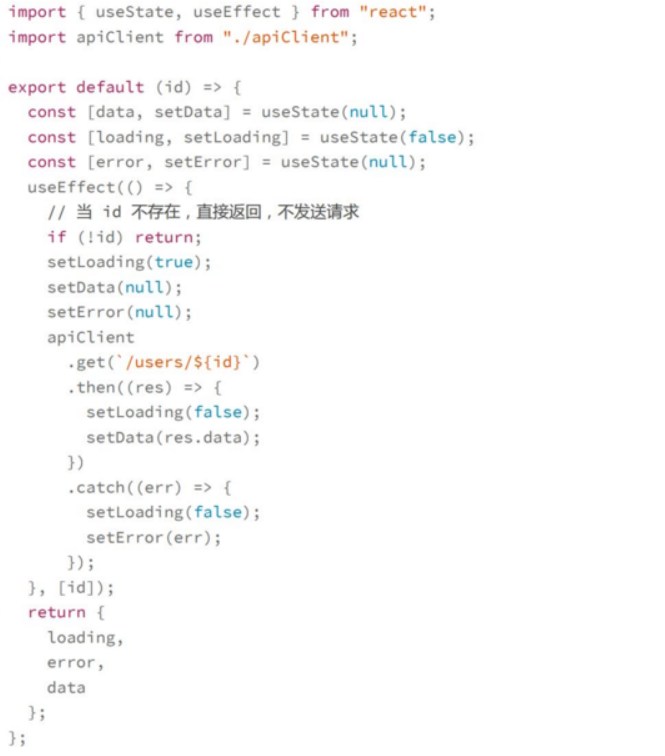
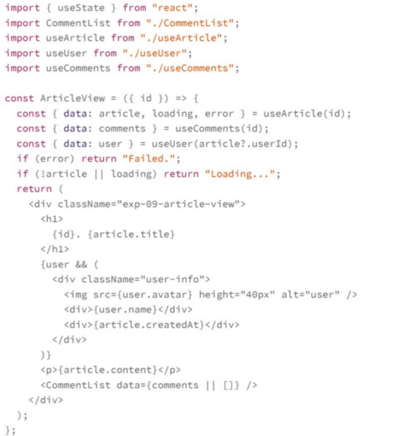

# 异步处理
## 创建一个API client
实现一个API Client通常需要考虑下面几个部分
1. 一般通用的Header，比如Authorization token
2. 服务器地址的配置，前端在开发和运行时可能会链接不同的服务器，比如本地服务器或者测试服务器，此时这个API Client内部可以根据当前环境判断该连接哪个URl
3. 请求未认证的处理，比如token过期了，需要有一个同归的地方处理，需要弹出对话框提示用户重新登录

## 封装远程资源

对远程资源进行封装，我们在书写组件的时候就可以把表现层逻辑写的更加简洁

## 多个API调用：如何处理并发和串行请求
加入一个完整的页面需要发送三个请求
1. 获取文章内容
2. 获取作者信息，包括名字和头像地址
3. 获取文章的评论

文章内容和评论都可以通过文章id来获取，作者的信息需要文章信息返回后，利用里面的作者id来获取
所有获取文章内容和文章评论是并行的，获取作者信息和其他是串行的
**react函数组件是一个同步函数**，没有办法使用await这样的同步方法，而是要把请求通过副作用触发，我们可以从**状态变化去组织异步调度**
useUser这个hooks在没有传入id的情况下就不发送请求，对比useArticle,唯一的变化就是在useEffect中加入了id是否存在的判断

在文章展示页面，我们可以使用下面的代码来实现

因为文章id已经传进来了，因此useArticle和useComments这两个hooks会发出两个并发的请求来获取数据，二useUser这个hookks则需要等到article内容返回后，获取到userInfo的信息，所以这就是一个串行的请求，需要等到文章内容的请求完成之后才能发起