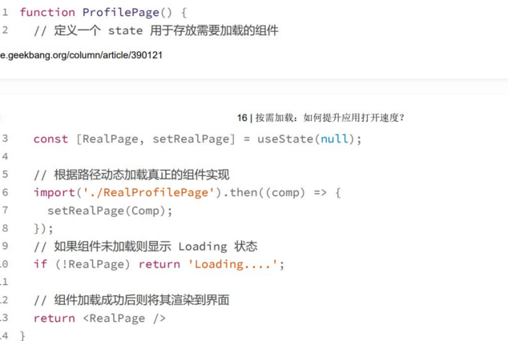
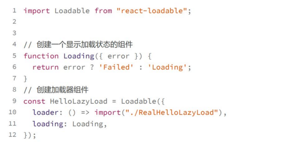
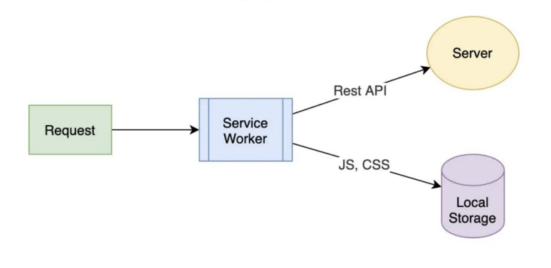
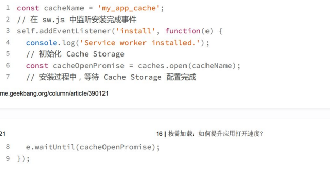
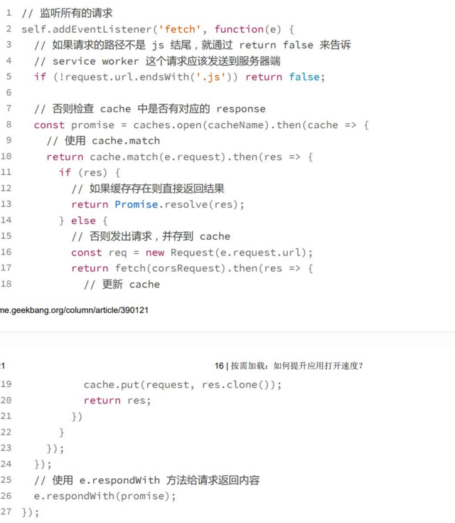

# 按需加载
为了提高首屏加载速度，我们就需要对应用进行分包
1. 首先，在打开某个页面时，只加载这个页面相关的内容，就是按需加载
2. 同时，为了提升后续应用的打开速度，就需要采用高效的缓存策略避免前端资源的重复下载

## 如何实现按需加载
**使用import语句，定义按需加载的起始模块**
所谓按需加载就是指在某个组件需要被渲染到页面时才会实际下载这个页面，以及这个页面依赖的所有代码，这样就不需要一开始载入所有代码，影响首屏打开速度
要实现这个功能本质在于我们需要由动态加载模块的能力，也就是运行时去加载模块而不是静态去import一个模块
这里的import和一般用于引入模块的静态声明方式不同，这个import函数会返回一个promise，这样在模块加载成功后，我们就可以在Promise的then回调函数中去使用这个给模块来，webpack等打包工具利用这样的语法去定义代码分包，webpack实现了这样的语法
**分包和按需加载得联系(个人感觉)**
这两个概念经常一起出现，但是在定义上分包是对代码进行拆分，拆分成各个模块，这样有多次依赖不会重复加载，按需加载就是打开页面才开始加载和这个页面相关的代码，个人认为按需加载其实就是分包的一个应用吧，按照需要才加载相关的代码，这相关代码就可以说是一个模块，一个包，要让按需加载能够走通，就需要将需要按需加载的模块进行拆分开才行。

import这个语句完全是由webpack进行处理的，webpack会将以./RealProfilePage模块为起点的所有依赖模块单独打成一个包，并且webpack还会生成代码，用于按需加载。
**按需加载的实现原理** : webpack利用动态import语法，自动实现了整个应用的拆包，而我们实际开发中，其实并不关心webpack是如何座到的，而**只需要考虑该在哪个位置使用import语句去定于动态加载的拆分点**
并不是任何模块都动态import加载，这个损害用户体验，导致每个功能都得等模块加载，总体需要采用得策略是按业务模块为目标去隔离，尽量在每个模块起始页面去定义这个差分点
## 使用react-lodable实现组件的异步加载
1. 定义一个加载器组件，在使用的地方依赖于这个加载器组件而不是原组件
2. 在加载器组件的执行过程中，使用 import 去动态加载真实的实现代码
3. 处理加载过程，和加载出错场景，确保用户体验

react-lodable的使用

Loadable这个高阶组件主要就两个API
loader:用于传入一个加载器回调，在组件渲染到页面时执行，在这个回调函数中，我们只需要直接使用 import 语句去加载需要的模块就可以
loading：表示用于加载状态的组件，在加载模块完成之前，加载器就会渲染这个组件，如果模块加载失败，那么react-lodable会将erros属性传递给Loading组件方便你根据错误状态来显示不同的信息给用户

## 使用service worker缓存前端资源
合理的缓存策略可以保证同样的前端资源永远只下载一次，从而让用户在使用一次你的应用之后，就永远不用下载同样的资源，从而极大提高APP的打开速度
service worker通常和PWA联系在一起用于开发离线的web应用，但service worker还提供了拦截前端请求的能力，使得它能够Local Storage成为一个独立的缓存方案

所有的浏览器发出的请求，service worker都能够拦截,rest api请求发送给服务器，js,css等静态资源，用cache storage存储
和浏览器自动缓存机制相比，service worker加cache storage这个缓存具有更高的准确性和可靠性
1. 缓存永不过期
2. 永远不会访问过期的资源，如果发布一个新版本，那么你就可以通过版本化的一些机制来确保用户访问到的一定是最新资源

**如何使用Service worker和cache storage**
service是一段独立于页面之外的JavaScript 脚本，不在web 页面中运行，但是会在web页面加载时，由一段代码去触发注册、下载和激活。一旦安装完成之后，Service Worker 就会拦截所有当前域名下的所有请求，由代码逻辑决定应该如何处理。
**1. 注册service worker**
>告诉浏览器当前域名下我需要使用service worker

上面的代码可以看出，首先需要判断浏览器是否支持service worker，支持就用register注册一个service worker，它的参数就是service worker脚本代码路径
**2. 在Service安装之后初始化缓存机制**
在service worker代码被下载和执行后，会触发安装完成的事件，这个时候你就可以在sw.js里面监听这个事件，从而初始化自己的缓存事件
下面代码演示安装事件中配置Cache Storage

Cache storage是浏览器提供的一种缓存机制，专门用于缓存一个请求的request和response的配对关系，还提供api用于判断某个request是不是又对应的response,所以cache storage可以认为是专门为了service worker提供的缓存机制
每次打开页面，其实都会调用service worker的register方法，但是浏览器判断脚本内容是否变化，有变化才重新安装
**3. 拦截请求**
安装完成后，就处于运行状态了，能够拦截前端请求，可以监听fetch事件来处理所有的请求，然后根据内容等条件来决定如何处理请求，比如使用本地缓存或者发送到服务器

这段代码采用一种缓存优先的策略，如果发现缓存就是用缓存，否则发送服务器端，将响应放到缓存，并同时返回给调用者，
这是一种高效的静态资源缓存，只会缓存一次，但对静态资源打包有一定要求，任何一次代码更新都需要有唯一路径，实际项目中一般会加入时间戳或者版本化的命名静态资源来实现