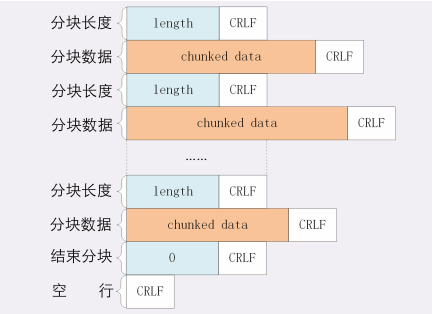
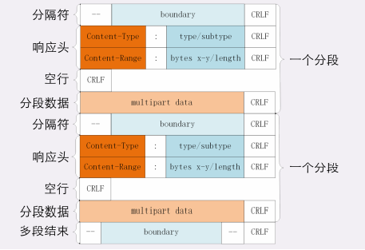
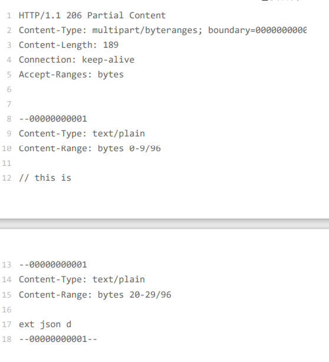

# http传输大文件的方法

## 数据压缩
通过内容协商Accept-Encoding和Content-Encoding字段来确定压缩方式，将压缩好的数据发送给浏览器，不过gzip等压缩算法通常只对文本文件由较高的压缩率，而图片，视频等多媒体数据本身就是高度压缩的，用gzip处理不会变小

## 分块传输
将其拆开分解成多个小块，把小块分批发给浏览器，浏览器收到之后在组装复原，这样浏览器和服务器不用在内存中保存全部文件，网络也不会被大文件长时间占用

chunked分块编码
在响应报文里用头字段Tranfer-Encoding:chunked来表示，意思就是报文中的body部分是分成许多的块逐个发送的
分块传输也可以用于流式数据，例如数据库动态生成的表单页面，body数据的长度是未知的，无法在Content-Length里面给出确切的长度，只能使用chunked方法分块发送
**Tansfer-Encoding:chunked**和**Content-Length**这两个字段是互斥的

**分块传输编码规则**
1. 每个分块包含两个部分，长度头和数据块
2. 长度头是以CRLF结尾的一行明文，用十六进制表示长度
3. 数据块紧跟在长度头后，最后也用CRLF，数据不包含CRLF
4. 最后一个用一个长度为0的块表示结束

**范围请求**
有了分块传输，服务器可以轻松收发大文件
但是想要拖动进度条，快进几分钟这样获取一个大文件其中的片段数据，分块传输并没有这个能力
范围请求不是web服务器必须的，服务器必须在响应头中使用字段**Accept-Ranges:bytes**明确告诉客户端支持范围请求
请求头**Range**是http范围请求的专用字段，格式是bytes=x-y,其中x和y是字节为单位的数据范围
服务器收到Range字段后，需要做四件事
1. 它必须检查范围是否合法，比如越界了就会返回状态码416
2. 范围正确服务器就可以更具Range头计算偏移量读取文件的片段，返回状态码206 Pratial Content
3. 服务器添加一个响应头字段Content-Range告诉片段的实际偏移量和资源的总大小，格式是“bytes x-y/length”
4. 最后发送数据，直接将片段用TCP发送给客户端，一个范围请求就算是处理完成了

多段下载，断点续传也是基于它实现的
要点
先发一个HEAD，看服务器是否支持范围请求，同时获取文件的大小
开N个线程，每个线程使用Range字段划分出各自负责下载的片段，发请求传输数据
下载意外中断不必重头再来一遍，只要根据上次的下载记录用Range请求剩下的一部分就可以

**多段数据**
Range 头里使用多个“x-y”，一次性获取多个片段数据。
这种情况需要使用一种特殊的 MIME 类型：“multipart/byteranges”，表示报文的 body 是由多段字节序列组成的，并且还要用一个参数“boundary=xxx”给出段之间的分隔标记。

之后用Content-type和content-range标记这段数据的类型和所在范围
请求

响应

报文里的“- -00000000001”就是多段的分隔符，使用它客户端就可以很容易地区分出多段 Range 数据。

**问题**
1. 分块传输数据的时候，如果数据里含有回车换行（\r\n）是否会影响分块的处理呢？
>不会，因为分块数据前有分块长度说明

2. 如果对一个被 gzip 的文件执行范围请求，比如“Range:bytes=10-19”，那么这个范围是应用于原文件还是压缩后的文件呢？
> 原文件
