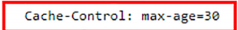
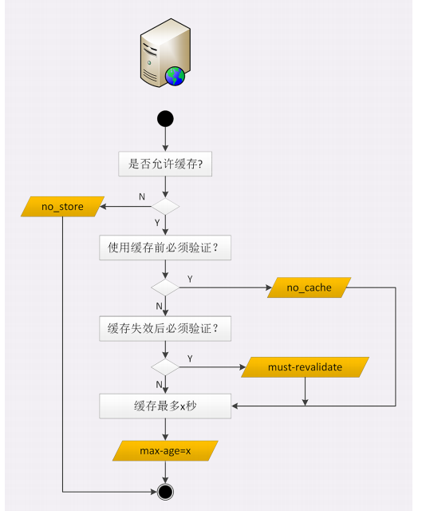

# http的缓存策略
流程
1. 浏览器发现缓存无数据，于是发送请求，向服务器获取资源
2. 服务器响应请求，返回资源，同时标记资源的有效期
3. 浏览器缓存资源，等待下次重用

## 服务器的缓存控制
服务器标记资源有效期使用的头字段是**Cache-Control**,里面的max-age=30就是资源的有效时间
这个时间的计算起点响应报文的创建时刻，即Date字段，也就是离开服务器的时刻

max-age是http缓存控制最常用的属性，此外在响应报文里还可以用其他属性来表示浏览器应该如何使用缓存
no_store:不允许缓存，用于变化非常频繁的页面
no_cache:可以使用缓存，只是在使用之前必须去服务器验证是否过期，是否有新版本
must-revalidate:如果缓存不过其就继续使用，但过期了如果还想要用就需要去服务器验证

## 客户端的缓存控制
不止服务器可以发Cache-Control头，浏览器也可以发Cache-Control.也就是说请求-应答的双方都可以用这个字段来进行缓存控制，互相协商缓存的使用策略
>前进后退按钮和刷新操作有什么区别?
在前进，后退，跳转这些重定向动作中浏览器不会夹带私货，只用最基本的请求头，没有Cache-Control,所以就会检查缓存，直接利用之前的资源，不再进行网络通信

## 条件请求
浏览器用Cache-Control做缓存控制只能是刷新数据，不能够很好地利用缓存数据，有因为缓存会失效，使用前必须要去服务器验证是否是最新版
1. 浏览器用两个连续的请求组成验证动作，显示一个Head获取资源的修改时间等元信息，然后与缓存数据比较，如果没有改动就使用缓存，节省网络流量，否则就再发一个get请求获得最新的版本
但这样的两个请求网络成本太高了，所以 HTTP 协议就定义了一系列“If”开头的“条件请求”字段，专门用来检查验证资源是否过期，把两个请求才能完成的工作合并在一个请求里做。
条件请求一共有 5 个头字段，我们最常用的是“if-Modified-Since”和“If-NoneMatch”这两个。需要第一次的响应报文预先提供“Last-modified”和“ETag”，然后第二次请求时就可以带上缓存里的原值，验证资源是否是最新的。
如果资源没有变，服务器就回应一个“304 Not Modified”，表示缓存依然有效，浏览器就可以更新一下有效期，然后放心大胆地使用缓存了。