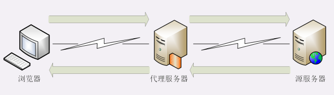
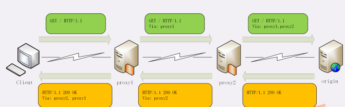

# http的代理服务

## 代理服务
他就是再客户端和服务器原本的通信链路中插入的一个中间环节，也就是一台服务器
代理服务就是指服务本身不生产内容，而是处理中间位置转发上下游的请求和响应，具有双重身份
代理有很多种类，例如匿名代理，透明代理，正向代理，反向代理
**计算机科学领域的任何问题，都可以通过引入一个中间层来解决**
代理最基本的一个功能是**负载均衡**，代理服务器掌握请求分发的大权，决定由后面的哪台服务器来响应请求
在负载均衡的同时，代理服务器还可以执行更多的功能
**健康检查**：使用“心跳”等机制监控后端服务器，发现有故障就及时“踢出”集群，保证服务高可用；
**安全防护**：保护被代理的后端服务器，限制 IP 地址或流量，抵御网络攻击和过载；
**加密卸载**：对外网使用 SSL/TLS 加密通信认证，而在安全的内网不加密，消除加解密成本；
**数据过滤**：拦截上下行的数据，任意指定策略修改请求或者响应；
**内容缓存**：暂存、复用服务器响应，

**代理相关头字段**
代理服务器需要用字段**Via**来表明代理身份
如果通信链路中有很多中间代理，就会在 Via 里形成一个链表，这样就可以知道报文究竟走过了多少个环节才到达了目的地。

via字段解决了**客户端和源服务器判断是否存在代理的问题**，但还不能知道对方的真实信息，因此有两个字段来解决这个问题
**X-Forwarded-For**的字面意思是“为谁而转发”，形式上和“Via”差不多，也是每经过一个代理节点就会在字段里追加一个信息。但“Via”追加的是代理主机名（或者域名），而“X-Forwarded-For”追加的是请求方的 IP 地址。所以，在字段里最左边的 IP地址就客户端的地址。
**X-Real-IP**是另一种获取客户端真实 IP 的手段，它的作用很简单，就是记录客户端 IP地址，没有中间的代理信息，相当于是“X-Forwarded-For”的简化版。如果客户端和源服务器之间只有一个代理，那么这两个字段的值就是相同的
> 专门的“代理协议”可以在不改动原始报文的情况下传递客户端的真实 IP。

1. 你觉得代理有什么缺点？实际应用时如何避免？
代理会增加链路长度，在代理上做一些复杂的处理。会很耗费性能，增加响应时间。
2. 你知道多少反向代理中使用的负载均衡算法？它们有什么优缺点？
随机，轮询，一致性HASH
