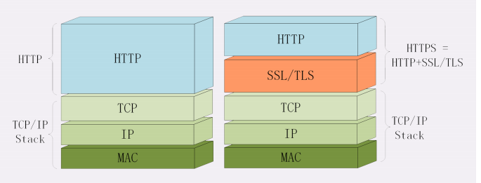

# HTTPS是什么?SSL/TLS是什么
HTTP有一些缺点，无状态可以加入cookie得到了解决，而另外两个缺点明文和不安全，仅凭http自身是无力解决的，需要引入新的https协议

## 为什么要有HTTPS？
因为http不安全，其明文的特点，整个传输过程完全透明，任何人都能够在链路中截获，修改或者伪造请求/响应报文

## 什么是安全
如果通信过程具备了四个特性，就可以认为是安全的
- 机密性
- 完整性
- 身份验证
- 不可否认

## 什么是HTTPS
https除了协议名http和端口号80这两点不同，https协议在语法，语义上完全一样
https与http最大的区别就是能够鉴别危险的网站，并且尽最大的可能保证你的上网安全，防御黑客和信息的窃取，篡改或则钓鱼，伪造
它把http下层的传输层协议由TCP/IP换成了SSL/TLS，让http运行在了安全的SSL/TLS协议上，收发报文不再使用Socket Api,而是调用专门的安全接口

## SSL/TLS
SSL就是安全套接层，由网景公司于1994年发明，有v2.v3两个版本。v1因为有严重缺陷未公开
SSL发展到v3已经证明了自身是个非常号的安全通信协议，于是互联网工程组IETF在1999年把他改名为TLS,目前应用最广泛的是TLS是1.2
TLS由记录协议，握手协议，警告协议，变更密码规范协议，扩展协议等几个子协议组成，综合使用了对称加密，非对称加密，身份认证等许多密码学前沿技术

## openSSL
它是一个著名的开源密码学程序库和工具库，几乎支持所有公开的加密算法和协议，已经成为了事实上的标准，许多应用软件都会使用它作为底层库来使用TLS功能，包括常见的web服务器Apache,Nginx