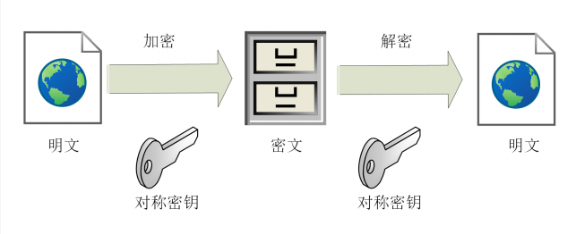
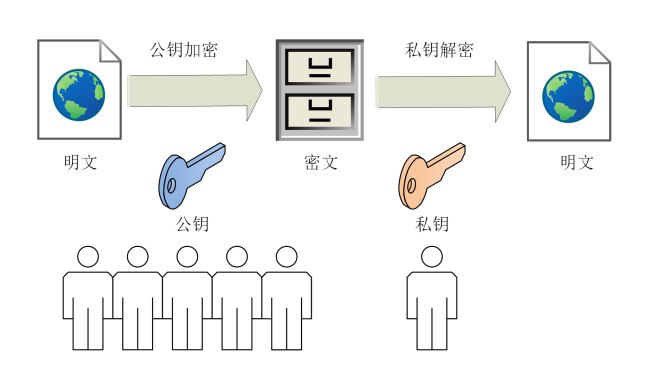
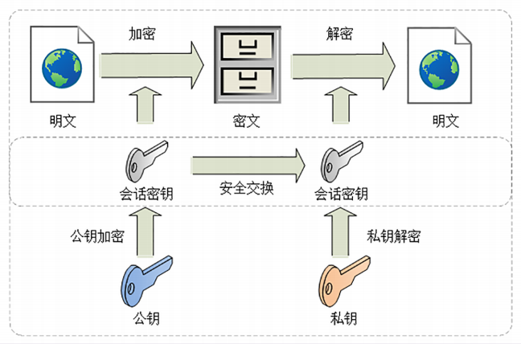

# 对称加密和非对称加密
按照密钥的使用方式，加密可以分成两个大类，**对称加密**和**非对称加密**

**对称加密**

目前常用的对称加密算法只有AES和ChaCha20

## 加密分组模式
它可以让算法用固定长度的密钥加密任意长度的明文，常用的是GCM,CCM和Poly1305
把上面这些组合起来，就可以得到TLS密码套件中定义的对称加密算法
比如，AES128-GCM，意思是密钥长度为 128 位的 AES 算法，使用的分组模式是 GCM；

## 非对称加密
对称加密中，如果你和网站约定的密钥在传递途中被黑客窃取，那他就可以在之后随意解密收发的收据，通信过程也就没有机密可言了
所以出现了非对称加密

非对称加密算法的设计要比对称加密算法难得多，在TLS里只有很少的几种，比如DH,DSA,RSA,ECC
**RSA**是其中最著名的一个，几乎是非对称加密的代名词，它的安全性基于整数分解的数学难题
**ECC**是非对称加密的后起之秀，它基于椭圆曲线离散对数的数学难题，160位的ECC相当于1024位的RSA，而224位的ECC相对于2048位的密钥，因为密钥短，所以响应的计算量，消耗的内存和带宽也就少，加密解密的性能就能上去

## 混合加密
虽然非对称加密没有“密钥交换”的问题，但因为它们都是基于复杂的数学难题，运算速度很慢，即使是 ECC 也要比 AES 差上好几个数量级。如果仅用非对称加密，虽然保证了安全，但通信速度有如乌龟、蜗牛，实用性就变成了零
