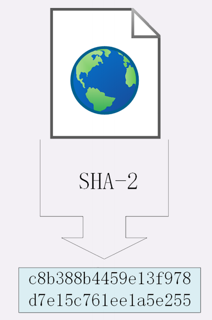
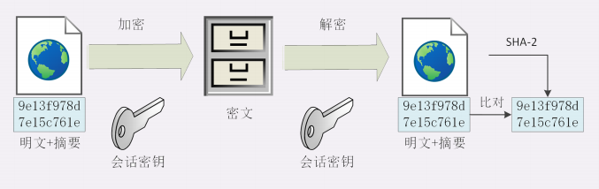
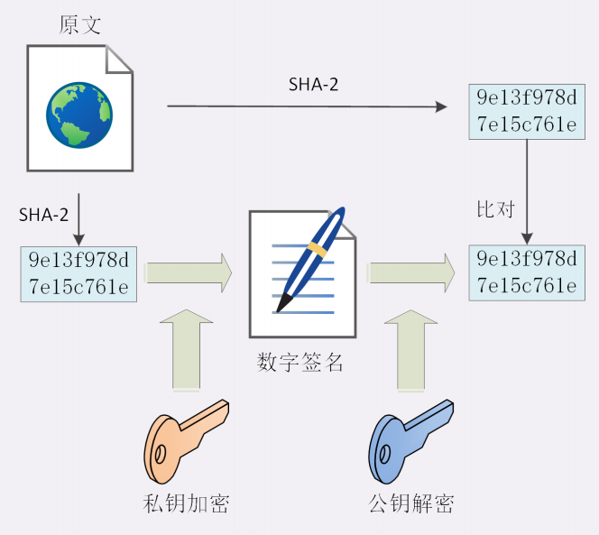

# 数字签名和证书
黑客虽然拿不到会话密钥，但可以窃听收集到足够多的密文，在尝试修改，重组后发给网站。
另外黑客也可以伪造身份发布公钥，如果你拿到了假的公钥，混合加密就完全失效了

## 摘要算法
实现完整性的手段主要就是摘要蒜贩，也就是常说的散列函数，哈希函数，它可以把任意长度的数据压缩成固定长度而且独一无二的摘要字符串，就好像给这段数据生成了一个数字指纹

常用的摘要算法:MD5和SHA-1，他们是最常用的两个摘要算法，能够生成16字节和20字节长度的数字摘要，但是这两个算法的安全性比较低，不够安全，TLS已经禁止使用了
目前TLS推荐使用的是SHA-2
SHA-2实际上是一系列摘要算法的统称，总共六种

## 完整性
摘要算法保证了数字摘要和原文是完全等价的，所以只要在原文后附上它的摘要就能够保证数据的完整性
不过摘要算法不具有机密性，如果明文传输，那么黑客可以修改消息后把摘要也一起改了，网站还是鉴别不出完整性。
所以，真正的完整性必须要建立在机密性之上，在**混合加密系统里用会话密钥加密消息和摘要**，这样黑客无法得知明文，也就没有办法动手脚了。

## 数字签名
通信过程安全了，但是黑客可以伪装成网站来窃取信息，它也可以伪装成你向网站发起支付，转账等消息，网站没有办法确认你的身份
使用私钥再加上摘要算法就能够实现数字签名，同时实现身份认证和不可否认
但又因为非对称加密效率太低，所以私钥只加密原文的摘要，这样运算量就小的多，而且得
到的数字签名也很小，方便保管和传输。
数字签名中利用私钥对原文生成的摘要进行加密，并且一起发送出去，请求方接收到后，利用公钥来解密，能够解开就表示对方是用私钥进行的加密，验证了发送方的身份

## 数字证书和CA
这里还缺少一个公钥的信任问题，因为谁都可以发布公钥，我们还缺少防止黑客伪造公钥的手段
找到一个公认的可信任的第三方，让它作为信任的起点，构建公钥的信任链
这个第三方就是我们常说的CA，具有极高的可信度，用它来给各个公钥签名，用自己的信誉来确保公钥无法伪造，是可信的
CA对公钥的签名认证也是有格式的，不是简单地把公钥绑定在持有者身份上就完事了，还包括序列号，用途，颁发者，有效时间等，把这些打成一个包再签名，完整证明公钥关联的各种信息，形成数字证书