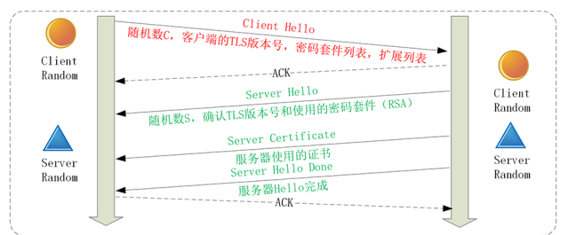
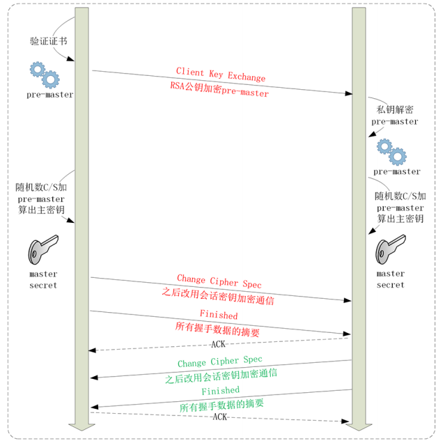
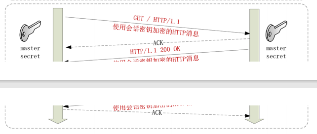

# 信任：TLS1.2连接过程解析

## TLS协议的组成
1. 记录协议（Record Protocol）规定了 TLS 收发数据的基本单位：记录（record）
2. 警报协议（Alert Protocol）的职责是向对方发出警报信息
3. 握手协议（Handshake Protocol）是 TLS 里最复杂的子协议，浏览器和服务器会在握手过程中协商 TLS 版本号、随机数、密码套件等信息，然
后交换证书和密钥参数，最终双方协商得到会话密钥，用于后续的混合加密系统。
4. 变更密码规范协议（Change Cipher Spec Protocol），它非常简单，就是一
个“通知”，告诉对方，后续的数据都将使用加密保护。

## ECDHR握手过程
1. 建立tcp连接
2. 浏览器首先发送一个Client hello消息，里面有客户端的版本号，支持的加密套件还有一个随机数
3. 服务器收到Client hello,会返回server hello消息，把版本号对一下，也给出一个随机数，然后从客户端的列表里选一个作为本次通信使用的加密套件
4. 服务器为了证明自己的身份，就把证书也发给客户端
5. 因为服务器选择ECDHE算法，所以在证书后发送Server key Change消息，里面是椭圆曲线的公钥（server params),用来实现密钥交换算法，再加上自己的私钥签名认证
6. 之后发送server hello dom消息，这样第一个消息往返就结束了，结果客户端和服务端通过明文共享了三个信息Client random,server random, Server Params
7. 客户端按照密码套件的要求，也生成一个椭圆曲线的公钥，用Client Key Change消息发送给服务器，现在客户端和服务器都拿到了密钥交换算法的两个参数Client params,server params
8. 利用ECDHE算法一阵算，算出一个新的东西，就是pre master,现在利用client random,server random和pre-master作为原始材料就可以生成用于加密会话的主密钥
9. 有了主密钥和派生密钥，客户端发送change cipher spec，然后再发送一个finished消息，把之前所有发送的数据做一个摘要，再加密一下让服务器做个验证
10. 服务器同样发change cipher spec和finished消息，双方都验证加密解密Ok，握手正式结束

## RSA握手过程
大致流程没有变，只是pre-master不用算法计算生成，而是客户端直接生成随机数，然后用于服务器的公钥机密

