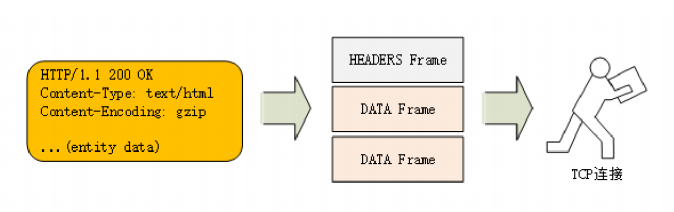
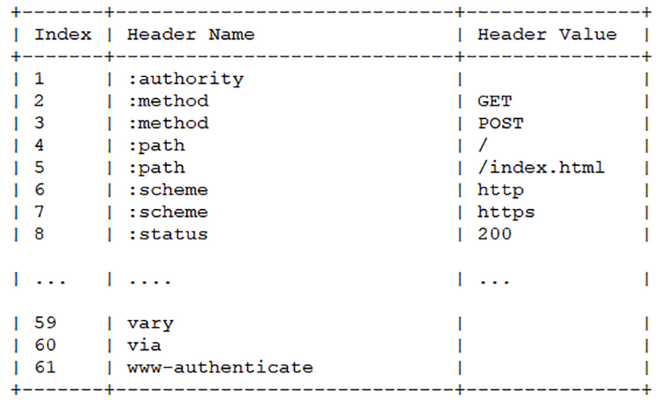
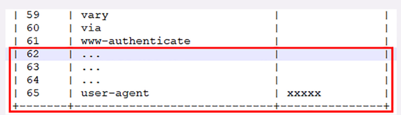
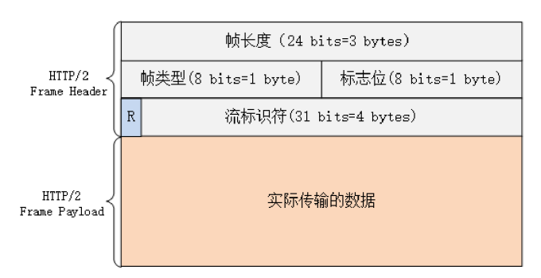

# http2特性和内核

**兼容http/1.1**
**头部压缩**
没有使用传统的压缩算法，而是开发了 专门的HPACK算法
**二进制格式**
大大方便了计算机的解析。原来使用纯文本的时候容易出现多义性，比如大小写、空白字符、回车换行、多字少字等等，程序在处理时必须用复杂的状态机，效率低，还麻烦。
把原来的“Header+Body”的消息“打散”为数个小片的二进制“帧”（Frame），用“HEADERS”帧存放头数据、“DATA”帧存放实体数据。

**虚拟的流**
消息的碎片到达目的地怎么组装起来？http/2为此定义了一个流的概念，它是二进制帧的双向传输序列，同一个消息往返的帧会分配一个唯一的流 ID。
用“流”同时发送多个“碎片化”的消息，这就是常说的“多路复用”（Multiplexing）——多个往返通信都复用一个连接来处理。
在“流”的层面上看，消息是一些有序的“帧”序列，而在“连接”的层面上看，消息却是乱序收发的“帧”。多个请求 / 响应之间没有了顺序关系，不需要排队等待，也就不会再出现“队头阻塞”问题，降低了延迟，大幅度提高了连接的利用率。
**强化安全**
由于 HTTPS 已经是大势所趋，而且主流的浏览器 Chrome、Firefox 等都公开宣布只支持加密的 HTTP/2，所以“事实上”的 HTTP/2 是加密的。也就是说，互联网上通常所能见到的 HTTP/2 都是使用“https”协议名，跑在 TLS 上面
**协议栈**

**前言连接**
http/2事实上是基于TLS，会有TLS握手和TCP握手，握手成功 之后，客户端必须要**发送一个连接前言用来确认建立HTTP/2连接**
它是一个标准的HTTP/1请求报文，使用纯文本的ASCII码格式，请求方式是特别注册的一个**关键字PRI**,全文只有24个字节
只要服务器收到这个字符串就知道客户端再TLS上想要的是HTTP/2协议，而不是其他协议
**头部压缩**
HPACK算法是专门用来压缩HTTP头部定制的算法，需要客户端和服务器各自维护一份索引表，也就是字典，压缩和解压缩就是查表和更新表的操作
为了方便管理和压缩，废除了原始的起始行的概念，把起始行里面的请求方法，URI，状态码等统一转换为头字段的形式，起始行中的版本号和错误原因因为没多大用被废除了，这些**不是头字段的头字段**就是**伪头字段**
与真实字段区分，这些伪头字段会在名字前面加一个":",比如:authority,:method
现在的HTTP报文全是key-value字段，于是HTTP/2就位一些常用的头字段定义了一个只读的静态表

如果key中没有对应的value，就需要用**动态表**，在静态表后，结构相同，但会在编码解码时随时更新

**二进制帧**
头部压缩后，HTTP/2就要把报文拆分成二进制的帧进行发送
HTTP/2 的帧结构有点类似 TCP 的段或者 TLS 里的记录，但报头很小，只有 9 字节，非常地节省

**帧长度**:前三个字节，默认上限时2^14,最大是2^24,帧通常不超过16K，最大是16M
**帧类型**：大致分为数据帧和控制帧，HEADERS帧和DATA帧属于数据帧，SETTING,PINGPRIORITY等则是用来管理流的控制帧
**标志位**：可以保留八位标志位，携带简单的控制信息，通常的标志位有END_HEADERS表示头数据结束，相当于 HTTP/1 里头后的空行（“\r\n”），END_STREAM表示单方向数据发送结束（即 EOS，End of Stream），相当于 HTTP/1 里 Chunked 分块结束标志（“0\r\n\r\n”）。
**流标识符**：也就是帧所属的流，虽然有四个字节，但是最高位被保留不用，所有只有31位可用，流标识符的上线是2^31

**流与多路复用**
**流是二进制帧的双向传输序列**
虽然帧是乱序收发的，但只要他们拥有相同的流ID,就都属于一个流，而且在这个流里帧不是无序的，而是有着严格的先后顺序。
http/2的流有什么特点?
1. 流是可并发的，一个HTTP/2连接上可以同时发出多个流传输数据，也就是并发请求，实现多路复用
2. 客户端和服务端都是可以创建流，双方互不干扰
3. 流是双向的，一个流里面客户端和服务器都可以发送和接受数据帧，也就是一个请求-应答来回
4. 流之间没有固定关系，彼此独立，但流内部的帧是有严格顺序的
5. 流可以设置优先级
6. 流ID不能够重用，只能顺序递增，客户端发起的ID是奇数，服务器发送的ID是偶数
7. 在流上发送“RST_STREAM”帧可以随时终止流，取消接收或发送；
8. 第 0 号流比较特殊，不能关闭，也不能发送数据帧，只能发送控制帧，用于流量控制。

因为客户端和服务器两端都可以创建流，而流 ID 有奇数偶数和上限的区分，所以大多数的流 ID 都会是奇数，而且客户端在一个连接里最多只能发出 2^30，也就是 10 亿个请求。
**ID用完怎么办**
发一个控制帧GOAWAY，关闭tcp连接
