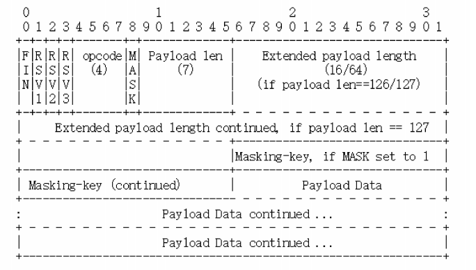

# websocket协议
websocket就是运行在web上，也就是HTTP上的Socket通信规范，提供与TCP socket类似的功能，使用它可以向TCP Socket一样调用下层协议栈，任意地收发数据
是一种基于TCP的轻量级网络通信协议，在地位上与http平级

## 为什么有websocket
请求应答是一种半双工的通信模式，在同一时刻只能一个方向上有动作，导致HTTP难以应用在动态页面，即时通信和网络游戏等要求实时通信的领域，通过**轮询**不断向服务器发送请求问有没有数据的方式来实现实时更新会因为大量无效请求耗费大量的带宽和CPU资源

## websocket特点
是真正的全双工通信协议，采用二进制帧语法，语义和HTTP完全不兼容，延用了HTTP的URI格式，但开头协议是ws和wss表示明文和加密的websocket
websocket的默认端口也选择了80和443，因为互联网上的防火墙屏蔽了绝大多数端口，对http的80，443放行，伪装成http协议，比较容易穿透防火墙，与服务器建立连接

## websocket帧结构
webscoket侧重于实时通信，http侧重于提高传输效率，因此两者的帧的差别很大

长度不固定，最少2个字节，最多14个字节
**FIN** : 是消息结束的标志位，相当于HTTP/2的END_STREAM
**保留位** : 三位，没有任何意义，但必须是0
**Opcode**: 操作码，四位，其实就是帧类型，比如1表示纯文本，2表示帧内容是二进制数据，8表示关闭连接，9，10表示连接保活的PING和PONG
**MASK**:掩膜标志位，1位，表示帧数据是否使用异或操作做简单的加密
**Payload len**:表示帧长度，是另一种变长编码，最少7位，最多7+64位，所谓webSocket帧最大是2^64
**Masking-key**:掩膜密码，它是由上面的标志位MASK决定的，如果使用掩膜就是4个字节的随机数，否则不存在
其实 WebSocket 的帧头就四个部分：“结束标志位 + 操作码 + 帧长度 +
掩码”

## webscoket握手
websocket握手是一个标准的HTTP GET请求，但是要带上两个协议升级的专用头字段
“Connection: Upgrade”，表示要求协议“升级”；
“Upgrade: websocket”，表示要“升级”成 WebSocket 协议。
为了防止普通http消息被意外识别成websocket，握手消息还增加了两个额外的认证用头字段
Sec-WebSocket-Key：一个 Base64 编码的 16 字节随机数，作为简单的认证密钥；
Sec-WebSocket-Key：一个 Base64 编码的 16 字节随机数，作为简单的认证密钥；

服务器收到请求报文后，看到上面四个字段，就知道这是webSocket升级请求，于是构造一个101 Swicthing protocol响应报文，通知客户端，改用websocket协议

把请求头里的Set-WebSocket-key的值加上一个uuid，在计算SHA-1摘要
客户端收到响应报文，就可以用同样的算法，对比值是否相等，如果相等，就说明返回的确实是刚才握手时连接的服务器，认证成功