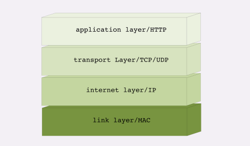
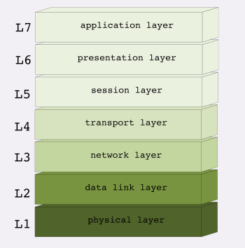

# 常说的四层和七层
## TCP/IP网络分层模型
把复杂的网络通信划分出多个层次，再给每个层次分配不同的职责，层次内只专心做事情就好

从上到下
**第一层:链路层**
工作在网卡这个层次，使用 MAC 地址来标记网络上的设备，所以有时候也叫 MAC层
**第二层:网际层**
第二层叫“网际层”或者“网络互连层”（internet layer），IP 协议就处在这一层。
**第三层:传输层**
这个层次协议的职责是保证数据在 IP 地址标记的两点之间“可靠”地传输，是 TCP 协议工作的层次
**第四层:应用层**
有各种面向具体应用的协议。例如 Telnet、SSH、FTP、SMTP 等等，当然还有我们的 HTTP。

>MAC 层的传输单位是帧（frame），IP 层的传输单位是包（packet），TCP 层的传输单位是段（segment），HTTP 的传输单位则是消息或报文（message）。

## OSI 网络分层模型

osi的分层模型再四层以上分的太细，而TCP/IP实际应用时的会话管理，编码转换，压缩等和具体应用联系紧密很难分开，例如http协议就同时包括连接管理和数据格式定义
所谓四层负载均衡就是指工作再传输层上，基于TCP/IP协议的特性，例如IP地址，端口号等实现对后端服务器的负载均衡
七层负载均衡就是指工作在应用层上，看到的是http协议，解译http报文里的url,主机名，资源类型等数据，再用适当的策略转发给后端服务器
HTTP 利用 TCP/IP 协议栈逐层打包再拆包，实现了数据传输，但下面的细节并不可见。