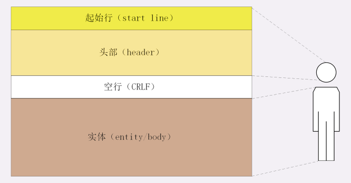
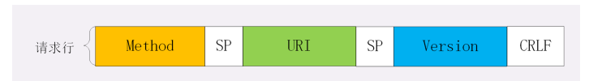
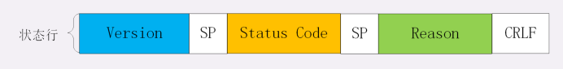

## http报文结构
http协议是一个纯文本协议，所以头数据都是ASCII码的文本，可以很容易地用肉眼阅读，不用借助程序解析也能够看懂
http协议的请求报文和响应报文的结构基本相同，由三大部分组成
1. 起始行，描述请求和响应的基本信息
2. 头部字段集合:使用key-value形式更详细地说明报文
3. 消息正文:实际传输的数据，它不一定是纯文本，也有可能是图片，视频等二进制文件

http协议规定报文必须有header，但是可以没有body，而且在header之后必须要由一个空行，就是CRLF，十六进制的0D0A

**请求行**
请求行,它简要地描述了客户端都要如何操作服务端的资源
- 请求方法，如get,post，表示对资源的操作
- 请求目标，通常是一个URI，表示请求方法要操作的资源
- 版本号:表示报文使用的HTTP协议版本

>这三个部分通常都是用空格来分割，最后用CRLF来结束

**状态行**
意思就是服务器响应的状态，比起请求行来说，状态行简单一些，同样也是三部分构成
- 版本号:表示报文使用的http协议版本
- 状态码L一个三文书，用代码的形式来表示处理结果
- 原因：作为数字状态码的补充

**头部字段**
头部字段都是以key-value形式分割，最后用CRLF换行表示字段结束，头部字段非常灵活，可以任意添加自定义头
注意点
1. 字段名不区分大小写
2. 字段名里不允许出现空格，可以使用连字符-,但是不能使用下划线
3. 字段名后面必须紧接着:，不能够有空格
4. 字段的顺序是没有意义的，可以任意排列不影响语义
5. 字段原则上是不能够重复的，除非这个字段本身没的语义允许，例如set-cookie

**常用头字段**
1. 通用字段
2. 请求字段
3. 响应字段
4. 实体字段

- host,属于请求字段，是http/1.1规范里面唯一一个要求必须出现的字段，告诉服务器这个请求应该由哪个主机来处理
- user-agent,请求字段，它使用字符串来表诉发起http请求的客户端，服务器可以依据它来返回最适合此浏览器显示的页面
- Date,通用字段，但是通常出现在响应头中，表示http报文创建的实践，客户端可以使用这个时间再搭配其他字段来决定缓存策略
- server字段，响应字段，告诉客户端当前正在提供web服务的软件名称和版本号，比如 “Server: openresty/1.15.8.1”，不是必须出现的
- content-length,表示报文里body的长度，也就是请求或响应实体的长度，如果没有这个字段，那么body就是不定长的，需要使用chunked方式分段传输

**问题**
1. 如果拼 HTTP 报文的时候，在头字段后多加了一个CRLF，导致出现了一个空行，会发生什么？
>因为header结尾为CRLF，后面的数据就是实体数据，如果多一个CRLF，那么这个CRLF就会被当成实体诗句

2. 讲头字段时说“:”后的空格可以有多个，那为什么绝大多数情况下都只使用一个空格呢？
>节省资源
