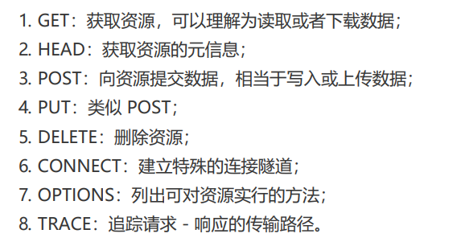

# 请求方法
目前HTTP/1,1规定了八种防范，单词都必须是大写形式

请求方法操作的目标不是本地资源，而是远程服务器上的资源，所有只能由客户端请求或者指示服务器来完成
客户端没有决定权，服务器由绝对的决策权力，服务器收到http报文之后看到里面的请求方法可以执行也可以拒绝或则改变动作的含义

**安全和幂等**
所谓安全就是请求方法不会破坏服务器上的资源，不会对服务器的资源造成实质的修改，按照这个定义，只有get和head是安全的

所谓幂等就是多次执行相同的操作，结果也都是相同，get和head的幂等性最高，delete可以多次删除同一个资源，效果都是资源不存在，所以也是幂等，post不是幂等，put是幂等的