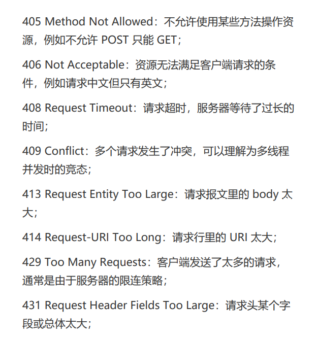

## 状态码
RFC标准把状态码分成了五类，用数字的第一位表示分类，状态码的实际可用范围是100~599
五类的具体含义
1xx :提示消息，表示目前是协议处理的中间状态，还需要后续操作
2xx :成功，报文已经收到并正确处理
3xx :重定向，资源位置发生变动，需要客户端重新发送请求
4xx :客户端错误，请求报文有误，服务器无法处理
5xx :服务器错误，服务器再处理请求时内部发生错误

**1xx**
偶尔会开到101 Switching Protocols
**2xx**
200 Ok是最常见的成功状态码，表示一切这个厂
204 no content,与200基本相同，但响应头后没有body数据
206 Partial Content:是HTTP分块下载和断点续传的基础，返回的body数据只是资源的一部分，通常还会伴随着头字段content-range表示响应报文body数据的具体范围，例如“Content-Range: bytes 0-99/2000”，意思是此次获
取的是总计 2000 个字节的前 100 个字节。
**3xx**
301永久重定向，此次请求的资源已经不存在了，需要改用新的URI再次访问，301h和302都会在响应头中使用Location来指明后续要跳转的URI，两者的根本区别在于语义，场景用法差距很大
304 Not Modifieid,它用于If-Modified-Since等条件请求，表示资源未修改
**4xx**
400 Bad Request,表示请求报文有错误，一个笼统的错误，开发web应用时应当尽量避免给客户端返回400
403 Forbidden，表示服务器禁止访问资源
404 NotFount,资源再本服务器上未找到

**5xx**
“500 Internal Server Error”与 400 类似，也是一个通用的错误码，服务器究竟发生了什么错误我们是不知道的。不过这对服务器是好事，通常不应该把服务器内部详细告诉外界
“501 Not Implemented”表示客户端请求的功能还不支持，这个错误码比 500 要“温和”一些，和“即将开业，敬请期待”的意思差不多
“502 Bad Gateway”通常是服务器作为网关或者代理时返回的错误码，表示服务器自身工作正常，访问后端服务器时发生了错误
“503 Service Unavailable”表示服务器当前很忙，暂时
无法响应服务，503是一个临时的状态，所以503响应报文通常还会有一个Retry-After字段，表示客户端可以在多久以后再次尝试发送请求