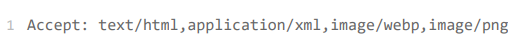
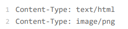
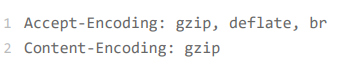

# http实体数据

## 数据类型与编码
http协议是应用层协议，数据到达之后还必须要告诉上层应用这是什么数据才行，如果http没有告知数据类型，那么很大几率会检查不出来文件类型，早在http协议诞生之前就已经有针对这种问题的解决方案，不过它是用在电子邮件系统里的，让电子邮件可以发送ASCII码意外的任意数据，方案的名字叫做多用途互联网邮件扩展，简称MIME
用来标记body数据的类型就是我们平常听到的MIME type

MIME Type分成8大类，每个大类下面再细分多个子类
1. text,text/plain,text/css
2. image 图片文件，image/gif,image/jpeg
3. audio/vidio,音频和视频数据，例如audio/mpeg,vidio/mp4
4. application,数据格式不固定，可能是文本也可能是二进制，必须由上层应用程序来解释，常见的由application/json,application/pdf,如果实在不知道数据是什么类型，就会使application/octet-steam,即不透明的二进制数据

在传输时为了节约带宽，有时候会压缩数据，需要**Encoding type**来告诉数据用的什么编码格式
1. gzip,互联网上最流行的压缩格式
2. defalte,流行度仅次于gzzip
3. br,一种专门为http优化的新压缩算法

**数据类型使用的头字段**
有了**MIME type**和**Encoding type**,无论时浏览器还是服务器都能够识别body类型，也就能够正确处理数据了

http协议为此定义了两个Accept请求头字段和两个content头字段，客户端用accept头告诉服务器希望接受什么样的数据，服务器用content头告诉客户端实际发送了什么数据
**Accept**字段标记的是客户端可理解的MIME type,可以用','分隔

相应服务器会在响应报文用头字段Content-Type告诉实体数据的真实类型

**Accept-Encoding**字段标记的是客户端支持的压缩格式，实际使用的压缩格式放在响应头字段**Content-Encoding**中

两个字段可以省略，表示不使用压缩

**语言类型和编码**
浏览器如何显示出每个人都可理解可阅读的语言文字呢
语言类型:en-US,zh-CN
字符集:同一段文字，用一种编码显示正常，换一种编码后可能就会变得一团糟，所以后再出现了unicode和utf-8
**语言类型使用的头字段**
**Accept-Language**标记客户端可理解的自然语言，可列出多个类型
**Content-Language**告诉客户端实体数据使用的实际语言类型
**Accept-Charset**字符集
响应头中没有Content-Charset,而是在Content-Type字段后面加上charset=***

**内容协商的质量值**
可以用一个特殊的q参数来表示权重设定优先级，最大为1，最小为0.01

**内容协商的结果**
有时候服务器会在响应头里多加一个Vary字段，记录服务器在内容协商时参考的请求头字段

可以认为时响应报文的一个特殊的版本标记，会随着响应报文一起变化，同一个URL可能会有多个不同的版本，主要用在传输链路中间的代理服务器实现缓存服务