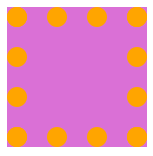

# 盒模型
box:盒子，每个元素在页面中都会生成一个矩形区域(盒子)

盒子类型
1. 行盒，display属性等于inline
2. 块盒,display属性等于block
3. 行盒在页面中不换行，块盒独占一行

display默认值为inline
浏览器默认样式表设置的块盒:容器元素，h1-h6,p
常见行盒:span，a,img,vidio

## 盒子组成部分
无论是行盒还是块盒，都由下面几个部分组成
1. 内容，content
   >css属性:width,height(盒子内容宽高)，内容部分通常叫做整个盒子的**内容盒 content-box**
2. 填充，padding
   >盒子边框到盒子内容的距离，padding
   填充区+内容区 = **填充盒 padding-box**
3. 边框，border
   >边框=边框样式+边框粗细+边框颜色
   边框+填充区+内容区=**边框盒 border-box**
4. 外边距，margin
   边框到其他盒子的距离
   
## 盒模型应用
### 改变宽高范围
默认情况下，width和heigt设置的是内容盒宽高
衡量设计稿尺寸时，往往使用的是边框盒，但设置width和height，则设置的是内容盒
1. 精确计算
2. css3:box-sizing
### 改变背景覆盖范围
默认情况下，背景覆盖边框盒

可以通过background-clip修改
### 溢出处理
overflow控制内容溢出边框盒，默认情况可见的
### 断词规则
word-break ,会影响文字在什么位置被截断换行
normal:普通，CJK字符(文字截断位置)，非cjk(单词位置阶段)
break-all：所有的字符都在文字处阶段
keep-all；所有字符在单词位置截断
### 空白处理
white-space:no-wrap 不换行
text-overflow:ellipsis

## 行盒盒模型
常见的行盒:包含具体内容的元素
span,strong,em,i,img,video,audio
### 显著特点
1. 盒子沿着内容延申
2. 行盒不能设置宽高
调整行盒子的宽高，应该使用字体大小，行高，字体类型，间距调整
3. 内边距
水平方向上有效，垂直方向上仅会影像背景，不会实际占据空间
4. 外边距
左右占据空间，垂直方向上不会实际占据空间
5. 边框
水平方向上有效，垂直方向上不会实际占据空间
