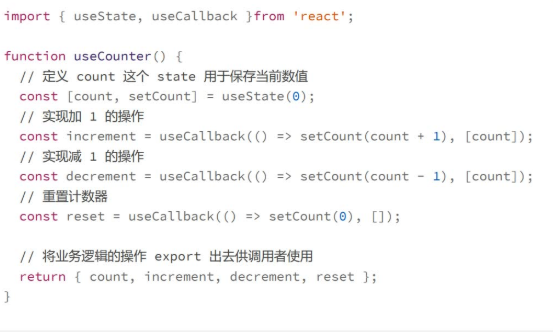
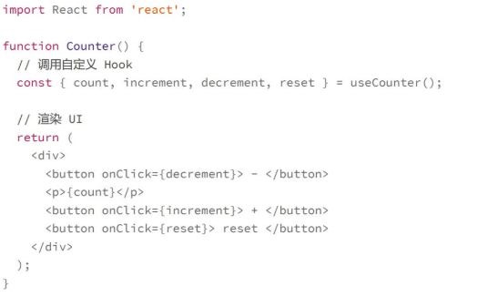
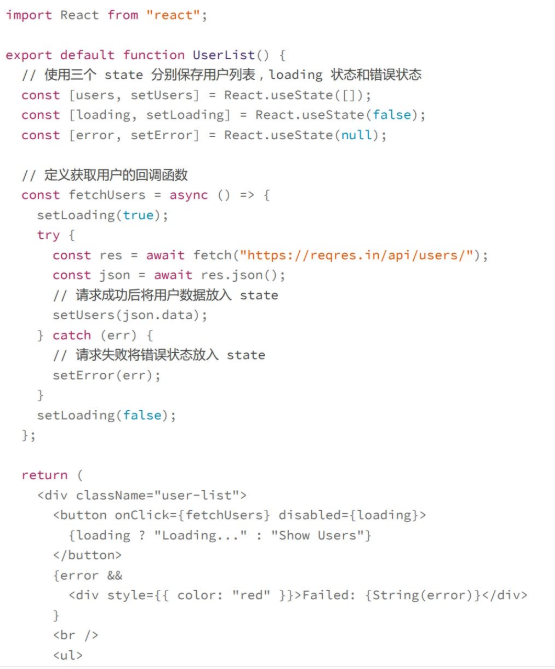
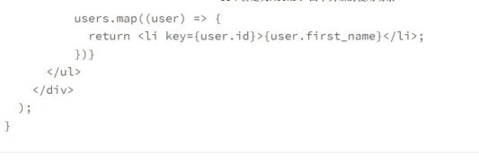
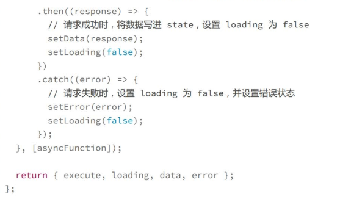
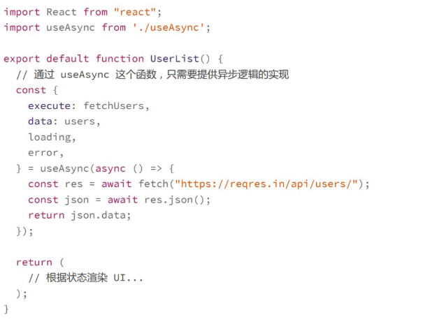

# 自定义hooks：四个典型的使用场景
首先问自己**这个功能中的哪些逻辑可以抽出来成为独立的 Hooks？**

## 如何创建自定义的hooks
声明一个名字以use开头的函数，比如useCounter,这个函数在形式上和普通函数没有什么差别，你可以传递任意参数给这个hooks,也可以返回任意值
Hooks和普通函数在语义上区别的，就在于**函数中有没有使用到其它的Hooks**
>如果创建了一个useXXX的函数，但是内部没有用任何其他的hooks，那么这个函数就不是一个hooks，而是一个普通函数，但是如果用了其他的hooks，那么他就是一个hooks

有了这个hooks，就可以使用了

这样把原来函数组件中的实现逻辑提取了出来，成为了一个单独的hooks，一方面能让这个逻辑得到重用，另一方面能让代码更加语义化，并且容易理解和维护
**自定义hooks的特点**
1. 名字一定是以use开头
2. 函数内部一定调用了其他的hooks，可以是内置的hooks也可以是自定义的hooks

##典型应用场景
**发起异步请求获取数据并显示在界面上**

自定义hook：useAsync来进行逻辑复用

那么有了这个 Hook，我们在组件中就只需要关心与业务逻辑相关的部分。比如代码可以简化成这样的形式：
