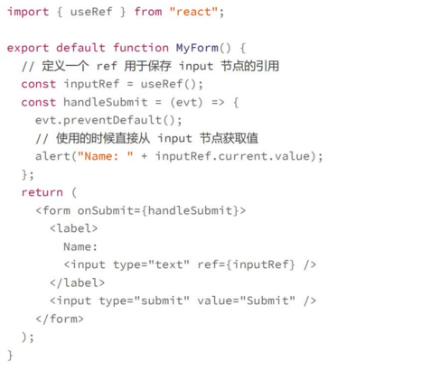
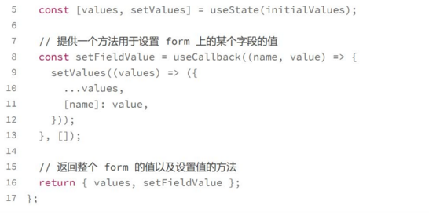
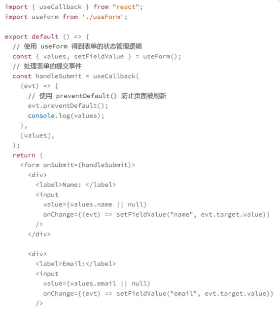
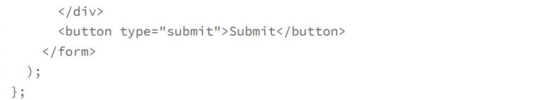
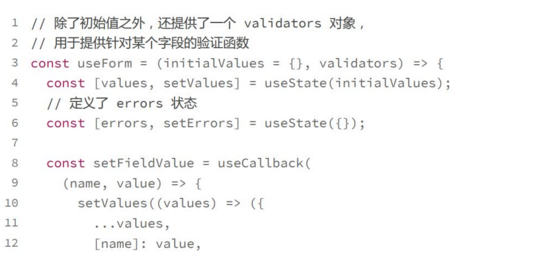
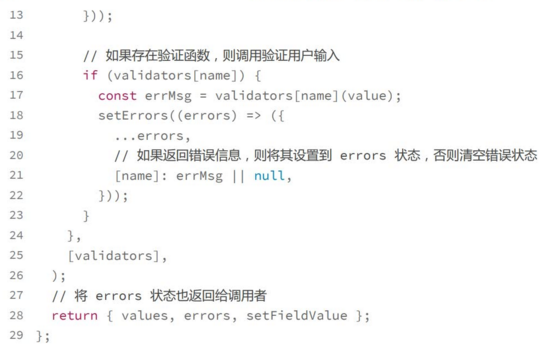
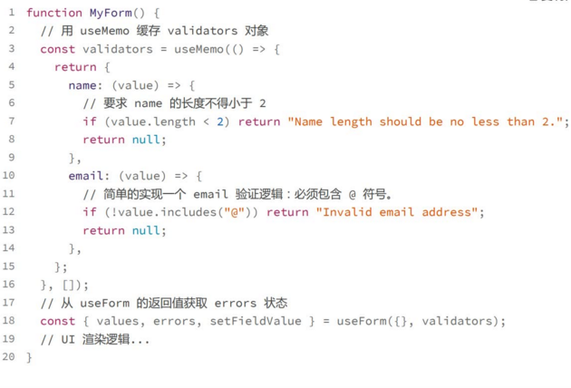

# Form:Hooks给form处理带来了哪些变化
使用表单，是react开发中最为困难的一部分，主要有两个方面的原因
一方面，react都是状态驱动，而表单却是事件驱动，一般我们需要将这些独立的事件转换为一定的应用程序状态，最终来完成表单的交互
另一方面，表单元素一般都有自己的内在状态，比如原生的input节点就允许用户输入，这就需要我i们在元素状态和表单状态之间做同步

## 在表单中使用React组件:受控组件和非受控组件
受控组件的使用

所谓非受控组件，就是表单元素的值不是由父组件决定，而是完全内部的状态

## 使用hooks简化表单处理
受控组件会遵循 下面两个步骤，
1. 设置一个State用于绑定表单元素的value
2. 监听表单元素的onChange事件，将表单值同步到value这个state

维护组件的状态的逻辑核心在于三个部分
1. 字段名字
2. 绑定value值
3. 处理onChange事件

既然每个表单的处理逻辑都是一直的，可以利用hooks实现逻辑的重用
**将表单的状态管理单独提取出来，成为一个可重用的Hook

有了这样的的hook，我们就不用很繁琐地为每个表单单独设置状态了，使用如下

## 处理表单验证
在useForm的基础上增加验证

使用

## 常用的react form框架
**把表单的状态逻辑和 UI展示逻辑基于 Hooks 进行分离**
- Antd Form
- Formik
- React Hook Form
