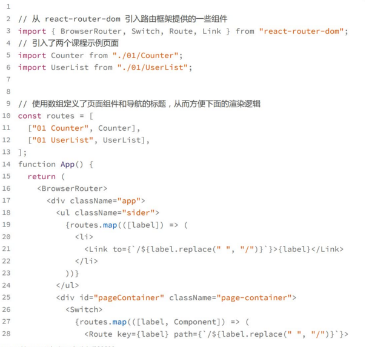
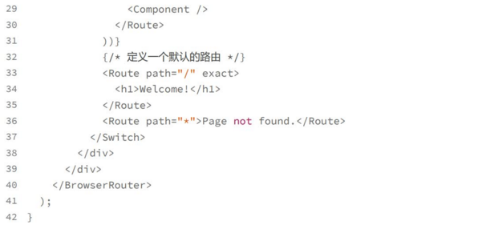
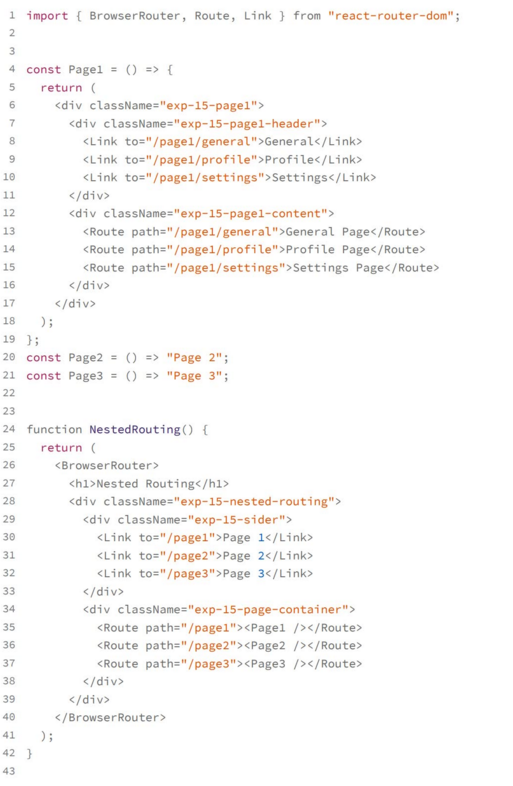
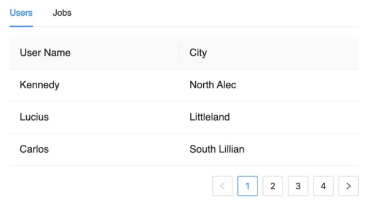
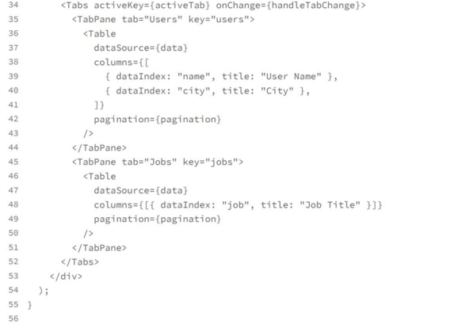
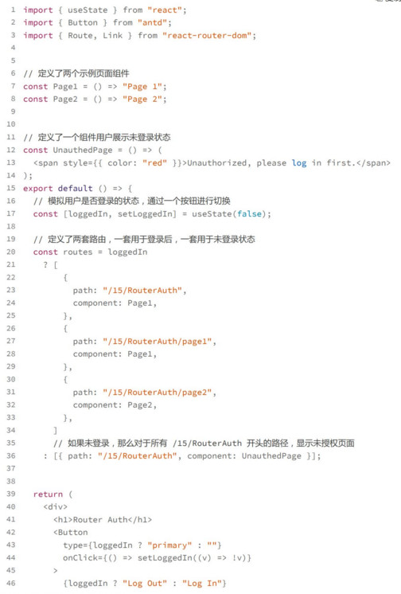
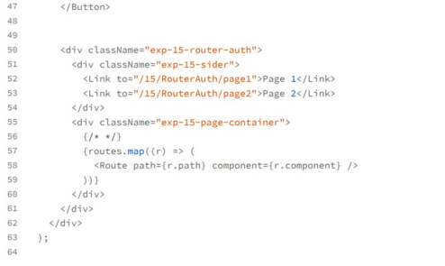

# 路由管理
所谓路由管理就是让你的页面能够根据URL的变化进行页面的切换，这是前端应用中一个非常重要的机制
一方面，路由机制提供了按页面去组织整个应用程序的能力，页面之间的交互可以主要通过URL来进行，从而让各个业务功能互相独立，实现逻辑的解耦
另一方面，URL适用于唯一的定义某个资源的，所有能够通过前端应用展现的每个资源，你都要考虑URL是否能够唯一地定位到这个资源上

## 理解路由的工作原理
在服务器端渲染的页面中，每个 URL 的变化都是全部页面内容的切换
而在前端路由管理中，则一般只在主内容区域 Content 部分变化， Header 和 Sider 是不会变化的
那么实现路由机制的核心逻辑就是根据URL路径这个状态来决定主内容区域显示什么组件
实现路由机制的核心逻辑就是根据URL路径这个状态来决定主内容区域显示什么组件

## 使用react router

BrowserRouter:标识用标准的 URL 路径去管理路由，比如 /my-page1 这样的标准
URL 路径。除此之外，还有 MemoryRouter，表示通过内存管理路由；HashRouter，标识通过 hash 管理路由。我们自己实现的例子其实就是用的 hash 来实现路由

Link:定义了一个导航连接，点击时可以无刷新地改变页面URL，从而实现React router控制的导航
Router:定义一条路由规则，可以匹配的路径，要渲染的内容等等
Swictch：在默认情况下，所有匹配的Route节点会被展示，但是Switch标记可以保证只有第一个匹配到的路由才会被渲染
## 使用嵌套路由:实现二级导航页面
所谓嵌套路由，也称为子路由，就是一个页面组件内部，还需要通过URl上的信息来决定组件内部某个区域该如何显示

需要路由框架具备两个能力
1. 能够模糊匹配，比如page1/general和page2/profile这两个路由，需要能够匹配到Page1这样一个组件，然后page1内部再更具general和profile这两个子路由决定展示到哪个具体的页面
2. Route能够嵌套使用

## 在URL中保存页面状态
wen应用的内容很容易分享，只要发送一个url，别人就能够看到和我们同样的内容
利用好这个特性，一方面可以提升用户体验，另一方面简化页面之间的交互

对于这样的页面，我们需要将tab状态和分页信息放到url中来实现共享
首先，我们需要利用 React Router 的参数功能来定义一条路由

代码

在这个实现中，我们遵循了唯一数据源的原则，避免定义中间状态去存储tab和页码的信息，而是直接去操作url,让代码逻辑更加清晰

## 路由层面实现权限控制
比如说，只有登录了的用户才能访问某些页面，否则就会显示为“未授权”并提示登录

