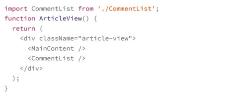
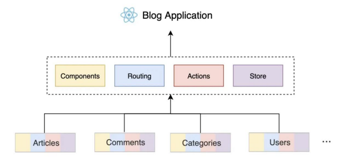
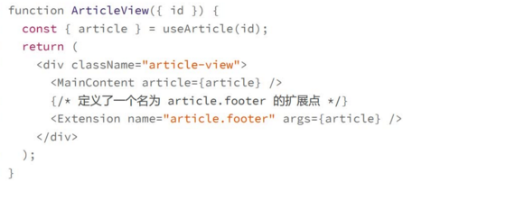

# 项目结构:为什么要按领域组织文件夹结构

## 软件复杂度的根源:复杂的依赖关系
**如何降低依赖，让整个大型应用的复杂度始终在可控范围内?**
既然要隔离复杂度，首先要做的就是在物理层面，让源代码能够按功能模块组织在一起，也就是要正确地按领域去组织你的项目文件夹结构
## 按领域组织文件夹结构

如上按照技术功能进行划分，在components,actions,hooks等文件夹下，再按照功能进行分类，而这种分类的做法经常是按照技术功能进一步划分，比如table,modals,pages等，这种做法会增加项目结构的复杂度，开发起来很不方便
一方面，对于一个功能我们无法直观地知道它相关的代码散落在哪些文件夹下面
另一方面，开发一个功能时，切换源代码会非常不方便
比如你在写分类列表功能时，就需要再组件，样式文件，action,reducer等文件之间频繁切换，额日期额项目很大，就要展开很长的树结构

产生这种开发难度的本质在于:**源代码没有按照业务功能组织再一起，而是从技术角度进行了拆分**,所以文件夹的组织，我们一定要按领域去组织源代码
一个与领域相关的文件夹自身包含了自己需要的所有技术模块，这样无论是理解代码实现还是开发时切换导航都会非常方便
组织项目结构

一个react应用由一些技术部件组成，比如compoennts,routing,actions,store等，如果我们将这些技术部件分散到不同领域的文件夹中，而每个领域文件夹都有自己的components,routing,actions,store等，这样每个文件夹都相当于一个小型的项目

## 处理模块的依赖
尽管每个模块之间已经处于独立文件夹，但其实还是可以任意依赖
从业务功能去理解，依赖可以分为两种
第一种就是硬依赖，如果功能A实现必须基于功能B，也就是没有功能B，功能A就不能够运行，那么就可以说A硬依赖于B
第二种就是软依赖，如果功能B扩展了功能A，也就是没有功能B，功能A自身也可以独立工作，就是缺少了某些能力
我们要达到的目标其实就是:删除一个功能，就像删除一个文件夹那么简单
虽然再业务功能上是一个软依赖，但是在代码层面，却往往做成看硬依赖，随着功能的不断增加，整个应用变得越来越复杂，最终降低了整体的开发效率
我们就要想办法让模块之间的交互不再通过硬依赖
**扩展点机制:在任何可能产生单点复杂度的模块中，通过扩展点的方式，允许其他模块为其增加功能**

在代码中，我们定义了一个名为 article.footer 的扩展点，允许其它模块为其贡献额外的React 组件，使其在页面的底部渲染。接着，这个扩展点会将当前的 article 作为参数传递给额外的组件。这样，我们就可以在评论功能自己的文件夹内去扩展这个扩展点，从而具体渲染评论列表的组件了
同样的，如果要增加点赞、打分等功能，我们也可以利用这个扩展点去实现 UI 的渲染。
使用这个扩展点的评论列表模块，可以用类似的代码来实现：
